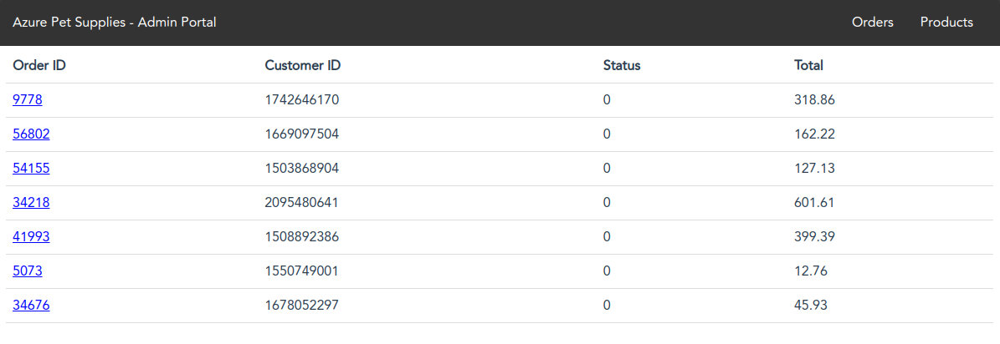
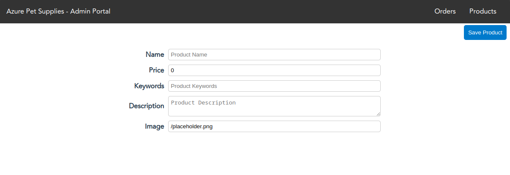
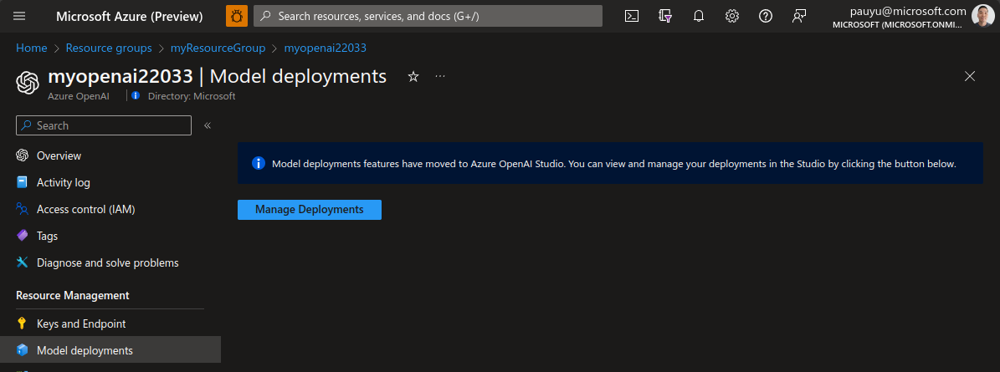
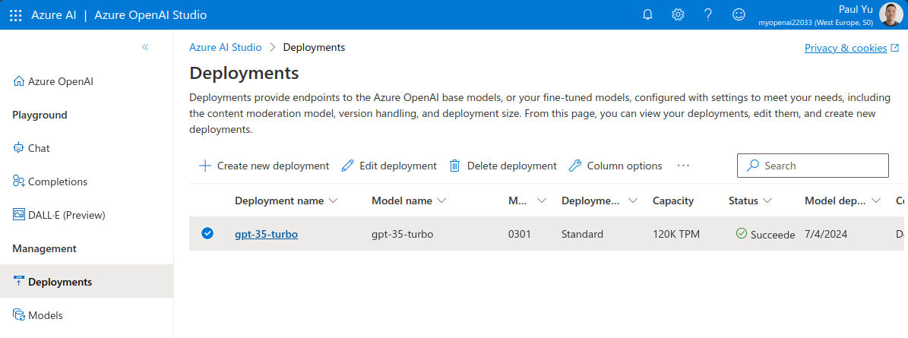
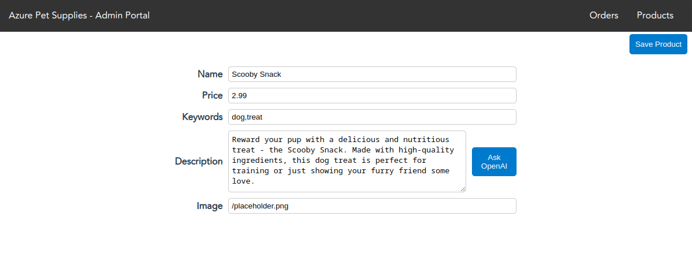
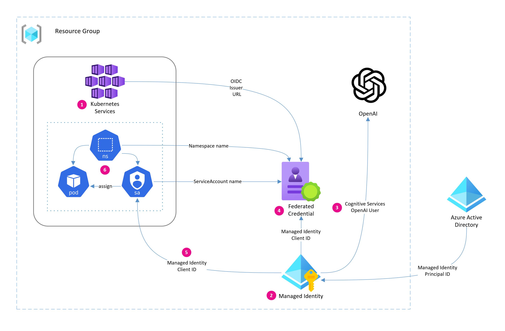

# Build intelligent apps with Azure OpenAI and AKS

In this workshop, you will learn how to build intelligent applications using Azure OpenAI and run them on Azure Kubernetes Service (AKS). This step-by-step guide will walk you through deploying the **AKS Store Demo** application to AKS, deploying an Azure OpenAI model, and configuring a microservice that integrates with Azure OpenAI. The demo application is a simple store application with a product catalog management page that will leverage Azure OpenAI to generate product descriptions.

## Objectives

The objectives of this workshop are to:

- Deploying applications to Azure Kubernetes Service
- Adding intelligent capabilities to an existing microservice
- Connecting to Azure OpenAI the preferred way using Microsoft Entra ID Workload Identity

## Prerequisites

The lab environment was pre-configured with the following:

- [Azure Subscription](https://azure.microsoft.com/free)
- [Azure CLI](https://learn.microsoft.com/cli/azure/what-is-azure-cli?WT.mc_id=containers-105184-pauyu)
- [Visual Studio Code](https://code.visualstudio.com/)
- [Git](https://git-scm.com/)
- Bash shell (e.g. [Windows Terminal](https://www.microsoft.com/p/windows-terminal/9n0dx20hk701) with [WSL](https://docs.microsoft.com/windows/wsl/install-win10) or [Azure Cloud Shell](https://shell.azure.com))

## Workshop instructions

When you see these blocks of text, you should follow the instructions below.

<div class="task" data-title="Task">

> This means you need to perform a task.

</div>

<div class="info" data-title="Info">

> This means there's some additional context.

</div>

<div class="tip" data-title="Tip">

> This means you should pay attention to some helpful tips.

</div>

<div class="warning" data-title="Warning">

> This means you should pay attention to some information.

</div>

<div class="important" data-title="Important">

> This means you should **_really_** pay attention to some information.

</div>

---

## Deploy an intelligent app to AKS

Your lab environment has been pre-configured with an AKS cluster, Azure OpenAI account, and a managed identity (with federated credential) that has been granted access to the Azure OpenAI account.

<div class="info" data-title="info">

> This code will be converted to Azure Bicep

</div>

```bash
# Create a resource group
az group create \
  --name myResourceGroup \
  --location westeurope

# Create an AKS cluster with OIDC issuer endpoint and Workload Identity enabled
AKS_OIDC_ISSUER=$(az aks create \
  -n myAKSCluster \
  -g myResourceGroup \
  --enable-oidc-issuer \
  --enable-workload-identity \
  --generate-ssh-keys \
  --query "aadProfile.oidcIssuer" -o tsv)

# Create the managed identity
az identity create \
  --resource-group myResourceGroup \
  --name myIdentity

# Create the federated credential for the managed identity
az identity federated-credential create \
  --name myFederatedCredential \
  --identity-name myIdentity \
  --resource-group myResourceGroup \
  --issuer ${AKS_OIDC_ISSUER} \
  --subject system:serviceaccount:default:ai-service-account

# Create the Azure OpenAI resource
AOAI_NAME=myopenai$RANDOM
AOAI_RESOURCE_ID=$(az cognitiveservices account create \
  -n ${AOAI_NAME} \
  -g myResourceGroup \
  -l westeurope \
  --kind OpenAI \
  --sku S0 \
  --custom-domain $AOAI_NAME \
  --query "id" -o tsv)

# Grant the managed identity access to the Azure OpenAI resource
az role assignment create \
  --assignee $(az identity show \
    --resource-group myResourceGroup \
    --name myIdentity \
    --query principalId -o tsv) \
  --role "Cognitive Services OpenAI User" \
  --scope ${AOAI_RESOURCE_ID}
```

### Deploy and test the demo app

With the lab environment created, let's deploy the demo app to AKS. The first thing we need to do is connect to the AKS cluster.

<div class="task" data-title="task">

> Run the following commands connect to your AKS cluster

</div>

```bash
az aks get-credentials -n myAKSCluster -g myResourceGroup
```

<div class="task" data-title="task">

> Verify you can connect to the AKS cluster

</div>

```bash
kubectl get nodes
```

With the AKS cluster connected, we can now deploy the demo app. The command below will deploy the AKS Store Demo without any AI capabilities.

<div class="task" data-title="task">

> Run the following command to deploy the AKS Store Demo app

</div>

```bash
kubectl apply -f https://raw.githubusercontent.com/Azure-Samples/aks-store-demo/main/aks-store-all-in-one.yaml
```

The demo app will take a few minutes to fully deploy.

<div class="task" data-title="task">

> Run the following command to get the status of the Pods and wait for all the Pods to be in the **Running** state

</div>

```bash
kubectl get po -w
```

Once you see that all the Pods are running, you can hit `Ctrl+C` to exit the logs.

### Test the demo app

Let's make sure we can access the store admin site.

<div class="task" data-title="task">

> Run the following command to get the IP of the store admin site

</div>

```bash
echo "http://$(kubectl get svc/store-admin -o jsonpath='{.status.loadBalancer.ingress[0].ip}')"
```

Click the URL from your terminal to open the store admin site in a browser. You should see the following:



Click on the **Products** link in the top navigation bar. You should see a list of products. Click on the **Add Product** button to add a new product.

You should see an empty form to add a new product. Here is where we want to add some intelligence to our app.



### Deploy an OpenAI model

Open the [Azure Portal](https://portal.azure.com) and navigate to the Azure OpenAI resource that was created for you. You can find it by searching for the resource group name that was created for you.

In the left navigation bar, click on **Model deployments**. You should see a pane that opens in the middle of the screen. Click on the **Manage Deployments** button.



<div class="tip" data-title="tip">

> Right-click on the **Manage Deployments** button and select **Open link in new tab**. This will open the **Manage Deployments** page in a new tab

</div>

In the **Azure OpenAI Studio**, click on the **+ Create new deployment** button.

Select the **gpt-35-turbo** model and enter a name of `gpt-35-turbo` for the deployment. Click the **Create** button.



### Add AI to demo app

With the new **gp-35-turbo** model deployed, we can now integrate it to our demo app.

The AKS Store Demo repo includes a container image that has the [**ai-service**](https://github.com/Azure-Samples/aks-store-demo/pkgs/container/aks-store-demo%2Fai-service) app already built and ready to go. The **ai-service** app is a simple microservice written in Python that uses the [Semantic Kernel SDK](https://aka.ms/sk/repo) to interact with OpenAI models. It includes a REST API endpoint that we can call to generate product descriptions.

Let's take a look at the source code of the demo app. 

<div class="task" data-title="task">

> Head over to the [AKS Store Demo repo](https://github.com/azure-samples/aks-store-demo) and take a look at the source code.

</div>

1. Take a look at the [README.md](https://github.com/Azure-Samples/aks-store-demo/blob/main/README.md) at the root of the repo. This is the main documentation for the demo app.
1. Take a look at the [README.md for the ai-service](https://github.com/Azure-Samples/aks-store-demo/tree/main/src/ai-service). This is the microservice that we will enable our app to use OpenAI models.
    1. The [./skills/ProductSkill/Description](https://github.com/Azure-Samples/aks-store-demo/tree/main/src/ai-service/skills/ProductSkill/Description) folder contains [Semantic Kernel](https://aka.ms/sk/repo) configuration that tells the microservice how to interact with OpenAI models. This is where our prompt engine is defined.
    1. The [./routers/description_generator.py](https://github.com/Azure-Samples/aks-store-demo/blob/main/src/ai-service/routers/description_generator.py) file contains the code that calls the Semantic Kernel SDK to generate product descriptions. You can see that Semantic Kernel SDK is used to interact with OpenAI models on either OpenAI directly or through Azure OpenAI.
    1. TODO: LOOK AT THE STORE-ADMIN CODE

All we need to do is update the **ai-service** Deployment manifest to use point to our Azure OpenAI resource.

<div class="task" data-title="task">

> Run the following commands to get the Azure OpenAI resource information

</div>

```bash
# Get the Azure OpenAI resource name
AOAI_NAME=$(az cognitiveservices account list \
  -g myResourceGroup \
  --query "[0].name" -o tsv)

# Get the Azure OpenAI endpoint
AOAI_ENDPOINT=$(az cognitiveservices account show \
  --resource-group myResourceGroup \
  --name $AOAI_NAME \
  --query properties.endpoint -o tsv)

# Get the Azure OpenAI deployment name
AOAI_DEPLOYMENT_NAME=$(az cognitiveservices account deployment list  \
  --resource-group myResourceGroup \
  --name $AOAI_NAME \
  --query "[0].name" -o tsv)

# Get the Azure OpenAI API key
AOAI_OPENAI_API_KEY=$(az cognitiveservices account keys list \
  --resource-group myResourceGroup \
  --name $AOAI_NAME \
  --query key1 -o tsv)
```

The [**ai-service** Deployment manifest](https://github.com/Azure-Samples/aks-store-demo/blob/main/ai-service.yaml) is already written but needs to be updated with the Azure OpenAI resource information we just retrieved. We'll use the `kubectl apply` command to apply the manifest to the cluster.

<div class="task" data-title="task">

> Apply the `ai-service` Deployment manifest to deploy the new microservice

</div>

```bash
kubectl apply -f - <<EOF
apiVersion: apps/v1
kind: Deployment
metadata:
  name: ai-service
spec:
  replicas: 1
  selector:
    matchLabels:
      app: ai-service
  template:
    metadata:
      labels:
        app: ai-service
    spec:
      nodeSelector:
        "kubernetes.io/os": linux
      containers:
      - name: order-service
        image: ghcr.io/azure-samples/aks-store-demo/ai-service:latest
        ports:
        - containerPort: 5001
        env:
        - name: USE_AZURE_OPENAI 
          value: "True"
        - name: AZURE_OPENAI_DEPLOYMENT_NAME 
          value: "${AOAI_DEPLOYMENT_NAME}"
        - name: AZURE_OPENAI_ENDPOINT 
          value: "${AOAI_ENDPOINT}"
        - name: OPENAI_API_KEY 
          value: "${AOAI_OPENAI_API_KEY}"
        resources:
          requests:
            cpu: 20m
            memory: 50Mi
          limits:
            cpu: 30m
            memory: 65Mi
---
apiVersion: v1
kind: Service
metadata:
  name: ai-service
spec:
  type: ClusterIP
  ports:
  - name: http
    port: 5001
    targetPort: 5001
  selector:
    app: ai-service
EOF
```

The **ai-service** app can take a minute or two to initialize. You can check the status of the deployment by running the following command.

<div class="task" data-title="task">

> Watch the **ai-service** Pod until it is running

</div>

```bash
kubectl get po -l app=ai-service -w
```

When you see that the **ai-service** Pod is running, you can hit `Ctrl+C` to exit the logs.

### Test the AI-enabled demo app

Now that the **ai-service** Pod is running, let's test the "Product add" functionality to make sure we can generate product descriptions using OpenAI.

<div class="task" data-title="task">

> Run the following command to get the IP of the store admin site again.

</div>

```bash
echo "http://$(kubectl get svc/store-admin -o jsonpath='{.status.loadBalancer.ingress[0].ip}')"
```

Click the URL from your terminal to open the store admin site in a browser. Click on the **Products** link in the top navigation bar. You should see a list of products. Click on the **Add Product** button to add a new product.

You should see an empty form to add a new product but now you will notice that there is an **Ask OpenAI** button.

Fill in the form with a product name, a price, and some keywords and click the **Ask OpenAI** button. You should see a product description generated by OpenAI.



Congratulations! You've successfully deployed an intelligent app to AKS and added intelligence to it using Azure OpenAI.

---

## Secure access to Azure OpenAI from AKS

We've added intelligent capabilities to our app using Azure OpenAI. However, we are storing the OpenAI API key as an environment variable in the `ai-service` Pod. This is not ideal as it can be easily compromised if the wrong person gets access to the Pod.

Let's illustrate what we want to fix.

<div class="task" data-title="task">

> Run the following command in a terminal.

</div>

```bash
kubectl describe pod --selector app=ai-service
```

Under `Environment`, you will notice that the `OPENAI_API_KEY` is available in plain text. This is not ideal as it can be easily compromised if the wrong person gets access to the pod.

### Overview of Microsoft Entra ID Workload Identity

Microsoft Entra ID Workload Identity is a capability that allows an Azure identity to be assigned to an application workload which can then be used to authenticate and access services and resources protected by Entra ID.

At a high-level, Entra ID federates with a Kubernetes cluster to establish trust, and Workload Identity uses [OpenID Connect](https://openid.net/connect/) (OIDC) to authenticate with Entra ID.

The Kubernetes cluster needs to be configured to use [ServiceAccount token volume projection](https://kubernetes.io/docs/tasks/configure-pod-container/configure-service-account/#serviceaccount-token-volume-projection) which will place a ServiceAccount token into a Pod. This token is sent to Entra ID where it is validated for authenticity and exchanged for an Entra ID bearer token. From there, the Pod uses the Entra ID token to access Azure resources.

How does Entra ID know how and where to validate this token, you ask? It validates the token against the OIDC endpoint that you tell it to when establishing the trust between Entra ID and your Kubernetes cluster.

The token exchange is handled within your app using the Azure Identity SDK or the Microsoft Authentication Library (MSAL), which we've already done in the previous section.

The diagram depicted [here](https://azure.github.io/azure-workload-identity/docs/concepts.html) gives a good visual representation of the token exchange process.

### Configuration overview

Here is a high level overview of the steps we will be performing in this section:

1. Enable Workload Identity and OIDC issuer endpoint on AKS cluster
1. Create a user-assigned managed identity
1. Grant role permission to managed identity
1. Create federated credential
1. Create Kubernetes ServiceAccount
1. Update `ai-service` Pod to use ServiceAccount

This diagram illustrates the configuration process.



#### User-Managed Identity

In the lab environment, a User-Assigned Managed Identity has been created for you which will be used to authenticate to Azure OpenAI endpoints.

<div class="task" data-title="task">

> Run the following commands to retrieve the client id and object id of the Azure User-Assigned Managed Identity as they will also be needed later.

</div>

```bash
# Get the managed identity client id
MANAGED_IDENTITY_CLIENT_ID=$(az identity show \
  --resource-group myResourceGroup \
  --name myIdentity \
  --query clientId -o tsv)

# Get the managed identity object id
MANAGED_IDENTITY_OBJECT_ID=$(az identity show \
  --resource-group myResourceGroup \
  --name myIdentity \
  --query principalId -o tsv)
```

#### Azure Role-Based Access Control

<div class="task" data-title="task">

> Ensure the managed identity has proper access to the Azure OpenAI resource.

</div>

```bash
# Get the Azure OpenAI resource id
AOAI_RESOURCE_ID=$(az resource list \
  --resource-group myResourceGroup \
  --resource-type Microsoft.CognitiveServices/accounts \
  --query "[0].id" -o tsv)

# Get the managed identity's access to the Azure OpenAI resource
az role assignment list \
  --assignee $MANAGED_IDENTITY_OBJECT_ID \
  --scope $AOAI_RESOURCE_ID \
  --query "[].{role:roleDefinitionName,scope:scope}"
```

If you see a role assignment with the role "Cognitive Services OpenAI User" for your Azure OpenAI account, then you are good to go. If not, then you will need to assign the role to the managed identity.

#### Federated Identity Credential

In the lab environment, an Entra ID Federated Credential has also been created. This establishes the trust between Entra ID and our Kubernetes cluster. When creating the federation, the Kubernetes Namespace and ServiceAccount name that we will be using on the Kubernetes Pod was passed in. This is critical as authentication requests from the Pod will include this information as the `subject` in the authentication request. If the request does not include a subject that matches what Entra ID expects, the request will be rejected.

<div class="task" data-title="task">

> Run the following commands to verify the Entra ID Federated Credential.

```bash
az identity federated-credential show \
  --name myFederatedCredential \
  --identity-name myIdentity \
  --resource-group myResourceGroup
```

Ensure the `subject` matches the Kubernetes Namespace and ServiceAccount name that we will be using on the Kubernetes Pod. It should look like this:

```json
system:serviceaccount:default:ai-service-account
```

Also the `issuer` should match the Kubernetes cluster's OIDC issuer endpoint.

To get the Kubernetes cluster's OIDC issuer endpoint, run the following command:

```bash
az aks show \
  --resource-group myResourceGroup \
  --name myAKSCluster \
  --query "oidcIssuerProfile.issuerUrl" -o tsv
```

We now have all the information we need to use Entra ID Workload Identity on AKS.

### Create Kubernetes Service Account

We first need to create a new ServiceAccount which will contain the Azure managed identity client ID. This is how Kubernetes will know which identity to use when authenticating to Entra ID.

<div class="task" data-title="task">

> Create a Kubernetes Service Account.

</div>

```bash
kubectl apply -f - <<EOF
apiVersion: v1
kind: ServiceAccount
metadata:
  annotations:
    azure.workload.identity/client-id: ${MANAGED_IDENTITY_CLIENT_ID}
  name: ai-service-account
  namespace: default
EOF
```

### Create Kubernetes ConfigMap

<div class="task" data-title="task">

> Create a Kubernetes ConfigMap to store the Azure OpenAI endpoint and deployment name.

</div>

```bash
kubectl create configmap ai-service-config \
  --from-literal=USE_AZURE_OPENAI=True \
  --from-literal=USE_AZURE_AD=True \
  --from-literal=AZURE_OPENAI_DEPLOYMENT_NAME=${AOAI_DEPLOYMENT_NAME} \
  --from-literal=AZURE_OPENAI_ENDPOINT=${AOAI_ENDPOINT}
```

### Update Kubernetes Deployment

Next we add the ServiceAccount to the Pod specification in the `ai-service` Deployment manifest.

We will also need to add the `azure.workload.identity/use` annotation to the Pod specification and set it to **true**. This tells Kubernetes to enable Workload Identity on the Pod.

<div class="task" data-title="task">

> Redeploy the `ai-service` with the ServiceAccount and the `azure.workload.identity/use` annotation set to **true**

</div>

```bash
kubectl apply -f - <<EOF
apiVersion: apps/v1
kind: Deployment
metadata:
  name: ai-service
spec:
  replicas: 1
  selector:
    matchLabels:
      app: ai-service
  template:
    metadata:
      labels:
        app: ai-service
        azure.workload.identity/use: "true"  # This enables Workload Identity
    spec:
      serviceAccountName: ai-service-account # This tells Kubernetes to use the ServiceAccount for authentication
      nodeSelector:
        "kubernetes.io/os": linux
      containers:
      - name: ai-service
        image: ghcr.io/azure-samples/aks-store-demo/ai-service:latest
        ports:
        - containerPort: 5001
        envFrom:
        - configMapRef:
            name: ai-service-config # This tells the Pod to use the ConfigMap for environment variables
        resources:
          requests:
            cpu: 20m
            memory: 50Mi
          limits:
            cpu: 30m
            memory: 65Mi
EOF
```

### Validate secure access

The `ai-service` app should now be using Entra ID Workload Identity to authenticate to Azure OpenAI. Let's verify this.

<div class="task" data-title="task">

> Run the following command old pod terminated and the new pod is running

</div>

```bash
kubectl get pods --selector app=ai-service -w
```

Once the new pod is running, get the pod logs

<div class="task" data-title="task">

> Run the following command to get the pod logs

</div>

```bash
kubectl logs --selector app=ai-service -f
```

Once you see the following log message, your app has initialized and is ready to accept requests.

<details>

<summary>`ai-service` Pod logs</summary>

```text
Incomplete environment configuration. These variables are set: AZURE_CLIENT_ID, AZURE_TENANT_ID
INFO:     Started server process [1]
INFO:     Waiting for application startup.
INFO:     Application startup complete.
INFO:     Uvicorn running on http://0.0.0.0:5001 (Press CTRL+C to quit)
```

</details>

<div class="task" data-title="task">

> Hit `Ctrl+C` to exit the logs.

</div>

Ensure the AOAI key is no longer set as environment variables in the pod

<div class="task" data-title="task">

> Run the following command to get the pod environment variables

```bash
kubectl describe pod --selector app=ai-service
```

Notice that the `OPENAI_API_KEY` environment variable is no longer set in our Pod.

Time to test the app.

<div class="task" data-title="task">

> Open a new terminal and run the following command to get the IP of the store admin site.

</div>

```bash
echo "http://$(kubectl get svc/store-admin -o jsonpath='{.status.loadBalancer.ingress[0].ip}')"
```

<div class="task" data-title="task">

> Open the URL in a browser and click on the **Products** link in the navigation bar. You should be able to add a new Product and get a description for it from OpenAI.

</div>

---

## Summary

Congratulations! You've successfully deployed an intelligent app on AKS and secured access to Azure OpenAI from using Entra ID Workload Identity.

In this workshop, you learned how easy it can be to "bolt-on" AI to an existing app. From there, we explored what Entra ID Workload Identity is and how to use it on AKS. Storing OpenAI API keys as environment variables in a Pod is not ideal as you can easily compromise the key if a malicious actor gains access to the Pod.

By using Entra ID Workload Identity, you can remove the need to store the OpenAI API key in the Pod and instead use Azure Identity SDK to authenticate to Azure OpenAI from within the application.

There are other options to secure the OpenAI API key such as using [Kubernetes Secrets](https://kubernetes.io/docs/concepts/configuration/secret/) or [Azure Key Vault](https://azure.microsoft.com/services/key-vault/) with the [Secrets Store CSI Driver](https://learn.microsoft.com/azure/aks/csi-secrets-store-driver) which can also leverage Entra ID Workload Identity. However, the Secret Store CSI driver will either mount the OpenAI API Key as a file in the container or put the key in a Kubernetes Secret which is only base64 encoded. Both of which can be compromised as well.

The recommendation is to use Entra ID Workload Identity with the Azure Identity SDK. There will be minimal code changes required; however, this will give you the most secure option as enables a "passwordless" authentication experience.

If you have any questions or feedback, feel free to reach out on our [`oss-labs` channel](https://discordapp.com/channels/723347736853741589/917999468316610570) on the [Microsoft Open Source Discord server](https://aka.ms/cloudnative/JoinOSSDiscord) 

## Additional Resources

- [How to configure Azure OpenAI Service with managed identities](https://learn.microsoft.com/azure/ai-services/openai/how-to/managed-identity)
- [What are workload identities?](https://learn.microsoft.com/azure/active-directory/workload-identities/workload-identities-overview)
- [What are managed identities for Azure resources?](https://learn.microsoft.com/azure/active-directory/managed-identities-azure-resources/overview)
- [Azure services that can use managed identities to access other services](https://learn.microsoft.com/azure/active-directory/managed-identities-azure-resources/managed-identities-status)
- [Use Entra ID workload identity with Azure Kubernetes Service (AKS)](https://learn.microsoft.com/azure/aks/workload-identity-overview?tabs=dotnet)
- [Tutorial: Use a workload identity with an application on Azure Kubernetes Service (AKS)](https://learn.microsoft.com/azure/aks/learn/tutorial-kubernetes-workload-identity)
- [Entra ID Workload Identity (GitHub)](https://azure.github.io/azure-workload-identity/docs/)
