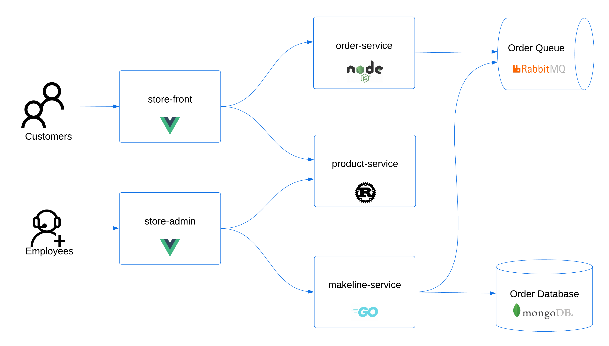
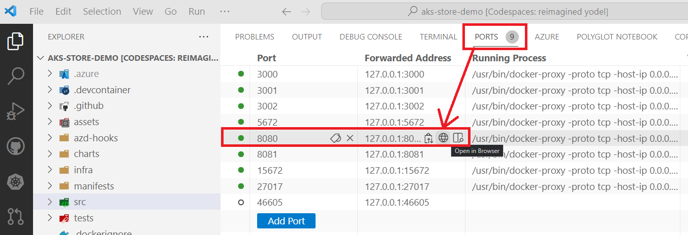
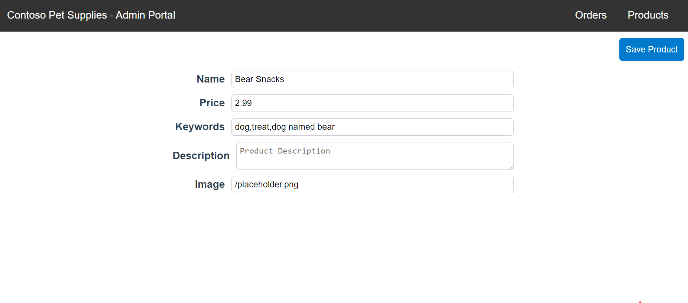
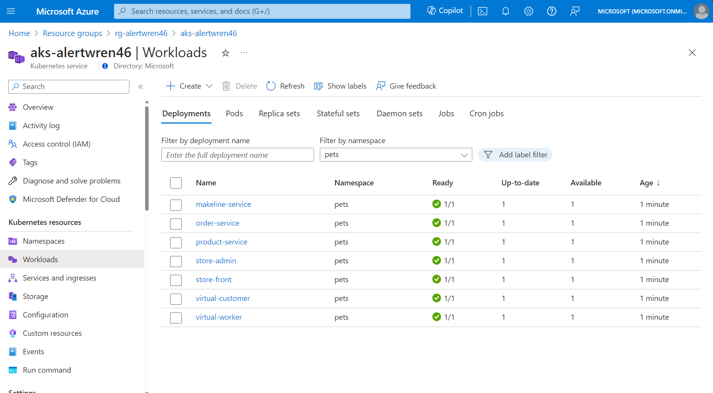
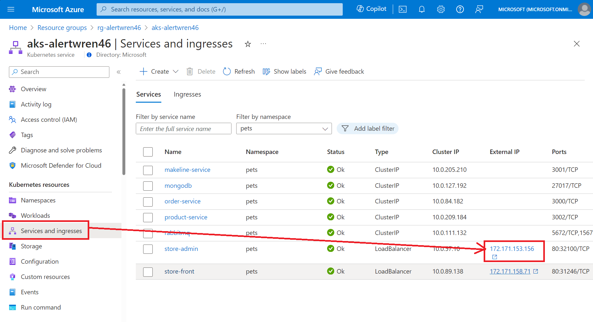
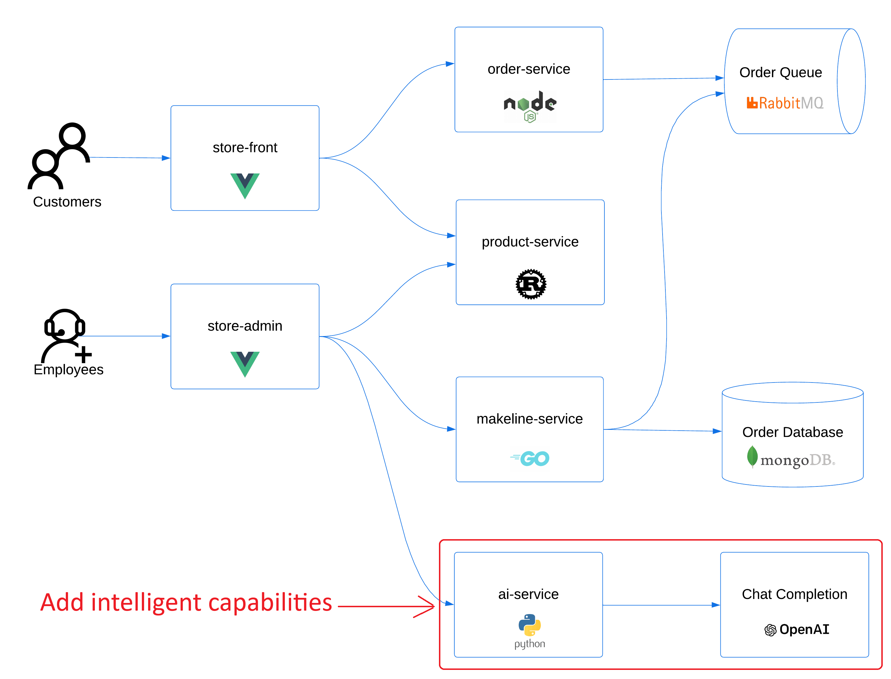
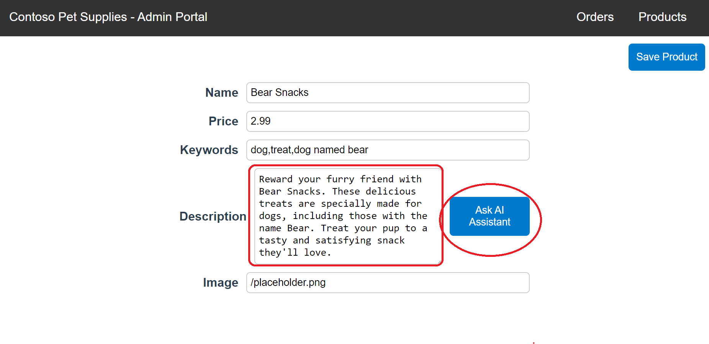
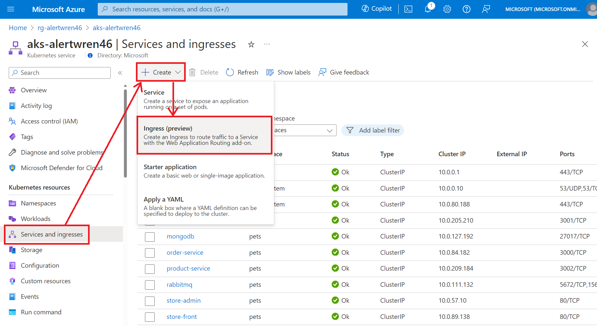
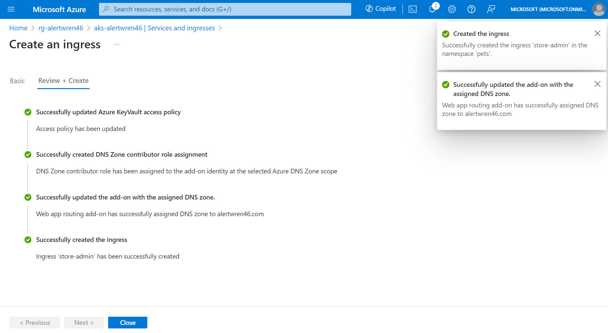

## Getting started

This workshop will guide you through the process of deploying an intelligent app to Azure Kubernetes Service (AKS).

### Objectives

The learning objectives of this workshop are:

- Introduce you to the AKS demo app and run it locally
- Add AI capabilities to the app and deploy it to AKS using Azure Developer CLI
- Enable the AKS application routing add-on for secure access to the app
- Leverage Microsoft Copilot for Azure to help with your cloud operations

This workshop is designed to be completed in a hands-on manner. You will need to have the following prerequisites installed and configured on your local machine:

### Prerequisites

Opening the [AKS Store Demo repo](https://github.com/Azure-Samples/aks-store-demo) in [GitHub Codespaces](https://github.com/features/codespaces) is the preferred method for completing this workshop. It will provide you with a pre-configured environment with all the necessary tools and dependencies installed.

<div class="important" data-title="Important">

> You will need to have a GitHub account to use GitHub Codespaces so make sure you are signed into GitHub before opening the repo in Codespaces.

</div>

However, if you want to complete this workshop on your local machine or if you don't have a GitHub account, you will need the following tools installed:

- [Azure CLI](https://learn.microsoft.com/cli/azure/what-is-azure-cli)
- [Azure Developer CLI](https://learn.microsoft.com/azure/developer/azure-developer-cli/overview)
- [Visual Studio Code](https://code.visualstudio.com/)
- [Docker Desktop](https://www.docker.com/products/docker-desktop/)
- [kubectl](https://kubernetes.io/docs/tasks/tools/)
- [Helm](https://helm.sh/)
- [Git](https://git-scm.com/)
- [Terraform](https://www.terraform.io/)
- [Visual Studio Code](https://code.visualstudio.com/)
- Bash shell

### GitHub Codespaces

Open your browser and navigate to the [AKS Store Demo repo](https://github.com/Azure-Samples/aks-store-demo). Scroll down in the README and click on the "Open in GitHub Codespaces" button. In the Codespaces window, click on the "Create codespace" button. This will open a new Codespace with the repo cloned and within a few minutes, you'll be ready to go.

---

## Up and running locally

The AKS Store Demo app we will be working with is a simple e-commerce app built using microservices architecture. Here is the application architecture. 

### Application architecture

. 

You are free to fork this repo to experiment with any of the services. As you make application changes, you'll want to test it locally so we'll start there.

### What's Docker Compose?

Docker Compose is a tool for defining and running multi-container Docker applications. With Compose, you use a [YAML file](https://raw.githubusercontent.com/Azure-Samples/aks-store-demo/main/docker-compose.yml) to configure your application's services. Then, with a single command, you create and start all the services from your configuration.

Open a terminal in VSCode and run the following command to start the app.

```bash
docker compose up
```

### Browsing the store sites

This will take a few minutes to build and start all the containers. Wait until you see application logs in the terminal. Once you see that the application is up and running, click on the "Ports" tab in VSCode. You will see several ports listed. Click on the globe icon for port 8080 to open the "store-front" app in your browser. 



Take a few minutes to explore the app, then click on the globe icon for port 8081 to open the "store-admin" app. In this app, you can view orders and view/edit/add products. This is where we will add intelligence to the app so that we can lean on OpenAI's large language model (LLM) to help us write product descriptions.



When you're done exploring the apps, go back to the terminal and press **Ctrl+C** to stop the containers.

---

## Up and running on AKS

Now that we have a good understanding of the app, let's get this up and running on Azure Kubernetes Service (AKS) and add intelligent capabilities using Azure OpenAI.

There are guides that walk you through the process of deploying AKS, Azure OpenAI, and enabling workload identity authentication [here](https://learn.microsoft.com/azure/aks/open-ai-quickstart?tabs=aoai) and [here](https://learn.microsoft.com/azure/aks/open-ai-secure-access-quickstart).

But instead of following those guides, we'll use the Azure Developer CLI to deploy the app to AKS using a single command.

### What is Azure Developer CLI?

The Azure Developer CLI is a command-line tool that aims to simplify the way you manage Azure resources and deploy applications to it. It acts as a wrapper for Infrastructure as Code (IaC) tools like Azure Bicep and Terraform and also provides a way to deploy your app to Azure. 

There are a few basic commands you should know. First is the `azd provision` command. As you might have guessed, this command allows you to provision cloud infrastructure. It will invoke either Azure Bicep or Terraform templates. The next command is the `azd deploy` command. This command allows you to deploy your app to Azure. You can run these two command separately, but there is a third command, `azd up` that will allow you to do both.

These are just the basics. To learn more, you can run the `azd --help` command or check out the [Azure Developer CLI documentation](https://learn.microsoft.com/azure/developer/azure-developer-cli/reference).

### Running the `azd up` command

We will use the `azd up` command to get everything "up and running". But, in order to run the `azd up` command, you will need to be logged into Azure CLI and Azure Developer CLI. 

Run the following commands to log in.

```bash
# login to Azure CLI
az login

# login to Azure Developer CLI
azd auth login
```

Now that you are logged in, you can run the following command to deploy the app to AKS.

```bash
azd up
```

When you run `azd up` for the first time, you will be asked for a bit of information:

1. **Environment name**: This is the name of the environment that will be created so that Azure Developer CLI can keep track of the resources that are created. You can set this to "dev" for now.
2. **Azure subscription**: You will be asked to select the Azure subscription that you want to use. If you only have one subscription, it will be selected by default.
3. **Azure location**: You will be asked to select the Azure location where the resources will be created. You can select the location that is closest to you but you must ensure that the location supports all the resources that will be created. To play it safe, you can select "East US" for now.

After you have provided the information, the `azd up` command will start by registering Azure providers, features, and installing Azure CLI extensions. From there, it will invoke the `terraform apply` command, then execute "azd-hook" scripts, which is a neat way for you to "hook" into the deployment process and add any customizations. In our deployment, we will invoke a `helm install` command to apply our Kubernetes manifests. 

This will take a few minutes to complete.

### Validating the deployment

Once the deployment is complete, you should see a list of outputs that show the resources that were created. Make a note of the value for **AZURE_RESOURCEGROUP_NAME**. Open the [Azure Portal](https://portal.azure.com), and navigate to the resource group. You should see an AKS cluster. Click on the AKS resource to open it. In the **Kubernetes resources** section, click on the **Workloads** tab. You will see the application deployments in the **pets** namespace.



Click on the AKS resource, then click on the **Services and ingresses** tab. You will see the Kubernetes [Services](https://kubernetes.io/docs/concepts/services-networking/service/) that are deployed in your Kubernetes cluster. For the **store-admin** and **store-front** services, you'll notice that the **Type** is **[LoadBalancer](https://kubernetes.io/docs/concepts/services-networking/service/#loadbalancer)**. This means that the services are exposed to the internet via public IP addresses. You can click on the **External IP** to open the app in your browser.



Browse to the store-admin site and attempt to add a product.

### Adding intelligent capabilities to the app

Right now, our app is running exactly as it was when we ran it locally. We'll add intelligent capabilities to the app by deploying an Azure OpenAI account with a GPT-3 model and adding a new **ai-service** microservice to our AKS cluster.

Here is what the application architecture will look like after we add the **ai-service** microservice and Azure OpenAI.



### Deploy Azure OpenAI and the ai-service microservice

The sample repo has a `terraform` directory that contains the Terraform templates to deploy the Azure OpenAI account and the appropriate model. We simply need to tell Azure Developer CLI to deploy the Terraform templates.

Back in the VSCode terminal, run the following command to deploy the Azure OpenAI account and the ai-service microservice.

```bash
azd env set DEPLOY_AZURE_OPENAI true
```

Then run the `azd up` command again.

```bash
azd up
```

This won't take as long as the initial deployment. Once it's complete, you will see that an Azure OpenAI account has been created and the **ai-service** microservice has been deployed to the AKS cluster.

When you browse to the store-admin site again and attempt to add a product, you will notice that there is a new button next to the product description text box. Click on the button and you will see a new product description generated for you. This is done by sending a request to an Azure OpenAI endpoint. The request includes the product name and keywords. The response is the product description that is generated by the Azure OpenAI model.



Great we now have an intelligent app running on AKS! But, exposing your app using LoadBalancer-based services in Kubernetes not a best practice. We'll look at a better way to do this in the next section.

---

## Application Routing on AKS

In the previous section, we saw that the **store-admin** and **store-front** services are exposed to the internet via public IP addresses. This is not the best way to do it. Instead, we should use an [Ingress Controller](https://kubernetes.io/docs/concepts/services-networking/ingress-controllers/). An Ingress Controller is a Kubernetes resource that routes traffic to services.

Not familiar with how to put together a Kubernetes manifest for an Ingress resource? No problem! We can use the application routing add-on in AKS to do this for us.

### What is the application routing add-on?

In AKS, we can take advantage of [add-ons](https://learn.microsoft.com/azure/aks/integrations) to enable certain features. One of the add-ons that is available to us is the [application routing add-on](https://learn.microsoft.com/azure/aks/app-routing?tabs=default%2Cdeploy-app-default). This add-on provisions an [Ingress-Nginx Controller](https://kubernetes.github.io/ingress-nginx/) in the AKS cluster and is completely managed by Azure.

There are some advantages you get with the Azure-managed ingress controller such as an out-of-the-box integration with [Azure DNS](https://learn.microsoft.com/azure/dns/dns-overview) and [Azure Key Vault](https://learn.microsoft.com/azure/key-vault/general/overview). This means that you can have Azure create DNS records and manage SSL certificates for your Ingress resources.
As a developer, it's always good when you don't have to worry about setting up DNS records or managing SSL certificates 🥳 

### Preparing the environment for the application routing add-on

Let's provision the resources that are required for the application routing add-on. Our Terraform template did not include an Azure DNS, so we'll create one using Azure CLI.

#### Azure DNS zone

Run the following command to create an Azure DNS zone.

```bash
# load all terraform outputs into environment variables
eval $(azd env get-values)

# create an Azure DNS zone
az network dns zone create \
  --resource-group $AZURE_RESOURCEGROUP_NAME \
  --name "${AZURE_RESOURCENAME_SUFFIX}.com"
```

<div class="info" data-title="Info">

> We will be testing DNS by modifying the host file on our local machine so the domain name you specify here does not have to be a real domain name. It only needs to be unique within Azure so we'll use our randomized resource name suffix to ensure uniqueness. 

</div>

#### Azure Key Vault

When we initially provisioned the Azure resources using the `azd up` command, an Azure Key Vault was created for us. We will use the same Key Vault to store the SSL certificate that will be used by the Ingress Controller.

In the Azure portal, navigate to the Key Vault resource and click on the **Certificates** tab. Click on the **Generate/Import** button to create a self-signed certificate. Fill in the following information then click the **Create** button.

- **Certificate name**: petstore
- **Subject**: CN={YOUR_DOMAIN_NAME}

#### Kubernetes service type change

Before we enable the application routing add-on, we need to change the service type of the **store-admin** and **store-front** services from **LoadBalancer** to **ClusterIP**. This will remove the public IP and so that the application will only be exposed to the internet via the Ingress Controller.

Run the following command to update the service type.

```bash
kubectl patch service/store-admin -n pets -p '{"spec": {"type": "ClusterIP"}}'
kubectl patch service/store-front -n pets -p '{"spec": {"type": "ClusterIP"}}'
```

Now if you run the following command to get the services, you will see that the **store-admin** and **store-front** services are of type **ClusterIP**.

```bash
kubectl get service -n pets
```

### Enabling the application routing add-on

Up until now, we have been using the Azure Developer CLI and Azure CLI to provision resources. To enable the application routing add-on, we will use the Azure portal just to see how easy it is to do.

In the Azure portal, enable the ingress controller by navigating to the AKS resource, then click on the **Services and ingresses** tab. Click on the **Create** button to open the dropdown and select **Ingress (preview)**. This will enable the Application Routing and Secret Store CSI driver add-ons in your AKS cluster. 



After a few minutes, the add-ons will be enabled and you will be able to add an ingress for the **store-admin** and **store-front** services.

### Adding an ingress for the store-admin service

Staying in the **Services and ingresses** tab, click the three dots next to the **store-admin** service and select **Add ingress (preview)**. In the **Create ingress** pane, fill in the following information:

- **Ingress name**: store-admin
- **Namespace**: pets
- **Service**: store-admin

For the certificate details section, click the **Select a certificate** link. This will open a pane where you can select your Azure Key Vault and select your self-signed certificate you created earlier then click the **Select** button to close the pane.

For the domain name section, select **Azure DNS** as your DNS provider and select the Azure DNS zone that you created earlier. Fill in the subdomain name as **admin** and click the **Review + create** button.

After a few minutes, you will see that Azure has created a new ingress resource for the **store-admin** service and a bunch of other things to make it all work. It's magic 🪄 (ok, not really).



You'll notice that Azure updated the Azure Key Vault access policy and created a new DNS zone contributor role assignment. This enables the cluster to access data in the key vault and create DNS zone subdomain records for the ingress it creates.

On the Kubernetes side, it created a new [Secret](https://kubernetes.io/docs/concepts/configuration/secret/) resource that contains the SSL certificate and a new [Ingress](https://kubernetes.io/docs/concepts/services-networking/ingress/) resource that routes traffic to the **store-admin** service based on our new subdomain, while also using the TLS secret for SSL termination.

If you run the following command, you'll see the new Secret resource.

```bash
kubectl describe secret keyvault-store-admin -n pets
```

You should see a YAML manifest that looks something like this:

```text
Name:         keyvault-store-admin
Namespace:    pets
Labels:       secrets-store.csi.k8s.io/managed=true
Annotations:  <none>

Type:  kubernetes.io/tls

Data
====
tls.crt:  1180 bytes
tls.key:  1675 bytes
```

If you run the following command, you'll see the new Ingress resource.

```bash
kubectl describe ingress store-admin -n pets
```

You should see a YAML manifest that looks something like this:

```text
Name:             store-admin
Labels:           <none>
Namespace:        pets
Address:          20.75.235.197
Ingress Class:    webapprouting.kubernetes.azure.com
Default backend:  <default>
TLS:
  keyvault-store-admin terminates admin.alertwren46.com
Rules:
  Host                   Path  Backends
  ----                   ----  --------
  admin.alertwren46.com  
                         /   store-admin:80 (10.244.1.9:8081)
Annotations:             kubernetes.azure.com/tls-cert-keyvault-uri: https://akv-alertwren46.vault.azure.net/certificates/petstore
Events:
  Type    Reason  Age                From                      Message
  ----    ------  ----               ----                      -------
  Normal  Sync    54s (x2 over 91s)  nginx-ingress-controller  Scheduled for sync
  Normal  Sync    54s (x2 over 91s)  nginx-ingress-controller  Scheduled for sync
```

### Testing the ingress

To test this all out we can grab the external IP of the ingress and update our host file to point to it for our subdomain.

You can run this command to get the information you need to update your host file.

```bash
kubectl get ing store-admin -n pets -o jsonpath='{.status.loadBalancer.ingress[0].ip} {.spec.rules[0].host}'
```

You should see something like this:

```text
4.152.41.63 admin.alertwren46.com
```

Take the value that has been output to your terminal and add that to your host file on your local machine. From there, you should be able to browse to the subdomain and see the store admin site.

<div class="warning" data-title="Warning">

> When you browse to the site, you will see a warning that the site is not secure. This is because we are using a self-signed certificate. In a production environment, you would use a certificate from a trusted certificate authority.

</div>

Perform the same steps to add an ingress for the **store-front** service. You can use the same certificate that you created earlier.

---

## Microsoft Copilot for Azure to help with day-to-day operations

The Microsoft Copilot for Azure is an AI companion that helps you to design, operate, troubleshoot, and optimize your Azure resources. It's like having a cloud expert at your fingertips. It's a great tool to use when you're new to Azure and need help with day-to-day operations.

We'll look at some common use cases where Copilot for Azure can help you with your AKS cluster next.

<div class="warning" data-title="Warning">

> At the time of this writing, Copilot for Azure is in limited access preview and you do need to apply for access. You can sign up for the preview [here](https://aka.ms/MSCopilotforAzurePreviewRequest).

</div>

### Use case 1: Designing your AKS cluster

You can use Copilot for Azure to design your AKS cluster. This is useful when you need to plan and create your cluster.

In the Azure portal, click on the **Copilot** button in the top-right corner. You will see the Copilot for Azure dialog open up. In the text box, copy the following prompt and paste it into the Copilot for Azure text box (where it says "I want to...")

```text
What network plugin should I use for my AKS cluster if I want to ensure all network communication to the outside world is disabled by default but configurable?
```

You will see that the Copilot for Azure takes your prompt then researches against a vast amount of Azure documentation and provides you with a response. In this case, you will see a response from Copilot for Azure that suggests you use the Azure CNI network plugin with resource links for you to learn more. This is a great suggestion because the Azure CNI network plugin allows you to control network traffic in and out of your AKS cluster.

### Use case 2: Operating your AKS cluster

You can also use Copilot for Azure to operate your AKS cluster. This is useful when you need to manage your cluster. Let's see how we can enable Long Term Support (LTS) for our AKS cluster.

In the Azure portal, click on the **Copilot** button in the top-right corner (if it is not already open). In the text box, copy the following prompt and paste it into the Copilot for Azure text box (where it says "I want to...")

```text
How can I enable Long-Term Support for my AKS cluster?
```

Some other prompt examples can be things like how to upgrade Kubernetes versions, how to enable node security updates, how to enable monitoring, or how to enable Azure Policy for your AKS cluster.

### Use case 3: Troubleshooting you AKS cluster

You can use Copilot for Azure to troubleshoot your AKS cluster. This is useful when you need to diagnose and resolve issues with your cluster.

In the Azure portal, click on the **Copilot** button in the top-right corner (if it is not already open). In the text box, copy the following prompt and paste it into the Copilot for Azure text box (where it says "I want to...")

```text
Help! My store-front pods keep timing out and unable to serve requests. What should I do?
```

You should see some very common troubleshooting steps that you can take to resolve the issue. This is a great way to get started with troubleshooting your AKS cluster.

### Use case 4: Optimizing your AKS cluster

You can use Copilot for Azure to optimize your AKS cluster. This is useful when you need to improve the performance and cost of your cluster.

In the Azure portal, click on the **Copilot** button in the top-right corner (if it is not already open). In the text box, copy the following prompt and paste it into the Copilot for Azure text box (where it says "I want to...")

```text
How can I optimize my AKS cluster for cost?
```

You should see several recommendations that you can take to optimize your AKS cluster for cost. One of the recommendations might be to use cluster autoscaler to scale the number of nodes in your cluster based on demand.

You can ask follow-up questions to get more information on the recommendations that are provided.

```text
Can you show me how to configure autoscaling for my AKS cluster?
```

---

## Conclusion

Congratulations! You have successfully deployed an intelligent app to Azure Kubernetes Service (AKS) and leveraged Azure OpenAI to make product description generation a bit easier. 

Incorporating AI inferencing endpoints to your existing applications, is not much different than adding any other service to your microservices/cloud-native architecture. By combining the agility of Kubernetes with the power of Azure, you can build and run intelligent apps that are scalable, secure, and easy to manage. We saw how easy it was to deploy the AKS Store Demo app using the Azure Developer CLI, and how we can leverage the AKS Application Routing add-on to expose our apps to the internet in a more secure way.

But it doesn't stop with just deploying and running intelligent apps. We can lean on Microsoft Copilot for Azure to help with day-to-day operations. This is just the beginning. There are many more things you can do with AI + AKS and leveraging it as your platform for intelligent apps is a great start.

Check out the resources linked below to learn more!

## Clean up

Once you're done with the workshop, you can clean up the resources by running the following command in the VSCode terminal.

```bash
azd down --force
```

### Resources

- [AKS Store Demo repo](https://github.com/Azure-Samples/aks-store-demo)
- [Deploy an application that uses OpenAI on Azure Kubernetes Service (AKS)](https://learn.microsoft.com/azure/aks/open-ai-quickstart?tabs=aoai)
- [Secure access to Azure OpenAI from Azure Kubernetes Service (AKS)](https://learn.microsoft.com/azure/aks/open-ai-secure-access-quickstart)
- [Azure Developer CLI](https://learn.microsoft.com/azure/developer/azure-developer-cli/overview)
- [Managed `nginx` Ingress with the application routing add-on](https://learn.microsoft.com/azure/aks/app-routing?tabs=default%2Cdeploy-app-default)
- [Copilot for Azure](https://azure.microsoft.com/products/copilot)
