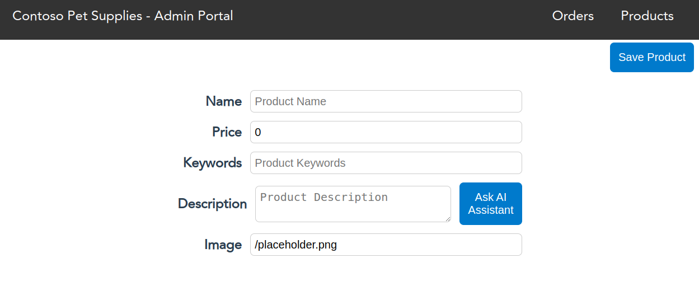
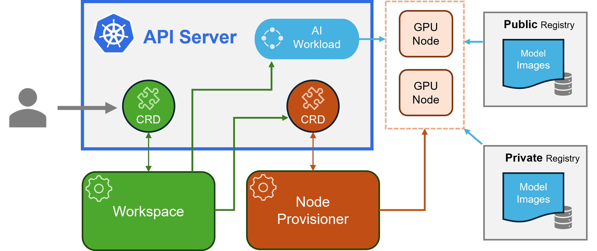

## Getting started

This workshop will guide you through the process of running popular open-source Large Language Models (LLMs) with HTTP-based inference endpoints inside your AKS cluster using the Kubernetes AI Toolchain Operator (Kaito). We’ll walk through the setup and deployment of containerized LLMs on GPU node pools and see how Kaito can help reduce operational burden of provisioning GPU nodes and tuning model deployment parameters to fit GPU profiles.

### Objectives

The learning objectives of this workshop are:

- Deploy a sample intelligent application to AKS
- Deploy and run an open-source LLM on AKS with Kaito
- Connect the sample app to the open-source LLM

This workshop is designed to be completed in a hands-on manner. You will need to have the following prerequisites installed and configured on your local machine:

### Prerequisites

Opening the [AKS Store Demo repo](https://github.com/Azure-Samples/aks-store-demo) in [GitHub Codespaces](https://github.com/features/codespaces) is the preferred method for completing this workshop. It will provide you with a pre-configured environment with all the necessary tools and dependencies installed.

<div class="important" data-title="Important">

> You will need to have a GitHub account to use GitHub Codespaces so make sure you are signed into GitHub before opening the repo in Codespaces.

</div>

However, if you want to complete this workshop on your local machine or if you don't have a GitHub account, you will need the following tools installed:

- [Azure subscription](https://azure.microsoft.com/pricing/purchase-options/pay-as-you-go)
- [Azure CLI](https://learn.microsoft.com/cli/azure/what-is-azure-cli)
- [Azure Developer CLI](https://learn.microsoft.com/azure/developer/azure-developer-cli/overview)
- [Visual Studio Code](https://code.visualstudio.com/)
- [Docker Desktop](https://www.docker.com/products/docker-desktop/)
- [kubectl](https://kubernetes.io/docs/tasks/tools/)
- [Helm](https://helm.sh/)
- [Git](https://git-scm.com/)
- [Terraform](https://www.terraform.io/)
- [Visual Studio Code](https://code.visualstudio.com/)
- Bash shell

### GitHub Codespaces

Open your browser and navigate to the [AKS Store Demo repo](https://github.com/Azure-Samples/aks-store-demo). Scroll down in the README and click on the "Open in GitHub Codespaces" button. In the Codespaces window, click on the "Create codespace" button. This will open a new Codespace with the repo cloned and within a few minutes, you'll be ready to go.

---

## Get up and running on AKS

We'll use the [Azure Developer CLI](https://learn.microsoft.com/azure/developer/azure-developer-cli/reference) to quickly provision an AKS cluster and deploy the AKS Store Demo app to it. The Azure Developer CLI is a command-line tool that aims to simplify the way you manage Azure resources and deploy applications to it. It acts as a wrapper around infrastructure as code tools like Terraform and Helm, and provides a set of commands to help you manage your Azure resources and deploy applications to it. Our sample application will be deployed using Terraform and Helm.


### Deploy the AKS Store Demo app

In order to run the `azd up` command, you will need to be logged into Azure CLI and Azure Developer CLI. 

Run the following commands to log in.

```bash
# login to Azure CLI
az login

# login to Azure Developer CLI
azd auth login
```

Next run the following command to create a new environment for the AZD deployment.

```bash
azd env new
```

Give the environment a name. It could be anything you like. For example, "kaito".


Next run the following command to deploy Azure OpenAI with the AKS Demo App.

```bash
azd env set DEPLOY_AZURE_OPENAI true
```

By default, the authentication method for the OpenAI API is set to use Open AI's API key. We want to use Microsoft Entra ID Workload Identity, so we need to run the following command.

```bash
azd env set DEPLOY_AZURE_WORKLOAD_IDENTITY true
```

<div class="important" data-title="Important">

> It is important to set the `DEPLOY_AZURE_WORKLOAD_IDENTITY` environment variable to `true` so that the AKS cluster will be created with the workload identity feature enabled.

</div>

Let's check the environment settings to make sure everything is set correctly.

```bash
azd env get-values
```

You should see the following output.

```text
AZURE_ENV_NAME="kaito"
DEPLOY_AZURE_OPENAI="true"
DEPLOY_AZURE_WORKLOAD_IDENTITY="true"
```

Now we're ready to deploy the intelligent app to AKS. Run the following command.

```bash
azd up
```

You will be asked for a bit of information:

1. **Azure subscription**: You will be asked to select the Azure subscription that you want to use. If you only have one subscription, it will be selected by default.
2. **Azure location**: You will be asked to select the Azure location where the resources will be created. You can select the location that is closest to you but you must ensure that the location supports all the resources that will be created. To play it safe, you can select "East US" for now.

After you have provided the information, the `azd up` command will start by registering Azure providers, features, and installing Azure CLI extensions. From there, it will invoke the `terraform apply` command then execute "azd-hook" scripts, which is a neat way for you to "hook" into the deployment process and add any customizations. In our deployment, we will invoke a `helm install` command to apply our Kubernetes manifests. 

This will take a few minutes to complete. Once it's done, you will see the output of the `terraform apply` command and the resources that were created. You can also view the resources in the Azure portal.

Once the deployment is complete, run the following command to load all the AZD environment variables into your shell.

```bash
eval "$(azd env get-values)"
```

### Validate the AKS Store Demo app

Get the public IP of the store-admin service by running the following command.

```bash
kubectl get service -n pets store-admin -o jsonpath='{.status.loadBalancer.ingress[0].ip}'
```

Open your browser and navigate to http://{YOUR_PUBLIC_IP}. You should see the AKS Store Demo app running.

Click on the "Products" link, then click the "Add Product" button. You should see a form to add a new product and beside the "Description" field, you should see a "Ask AI Assistant" button. This button will invoke the OpenAI API to generate a description for the product. Fill in the product name and keywords, then click the "Ask AI Assistant" button. You should see a description generated by the OpenAI API. Save the product to see it added to the list of products.



We know our sample app works well with Azure OpenAI. But what if we want to run a popular open-source Large Language Model (LLM) instead of using Azure OpenAI? This is where the Kubernetes AI Toolchain Operator (Kaito) comes into play.

In the next section, we'll see how we can use Kaito to deploy an open-source LLM to AKS and swap out the Azure OpenAI integration with an open-source LLM.

---

## What is Kaito?

Azure has recently open-sourced a project called [Kaito](https://github.com/Azure/kaito). Kaito, short for Kubernetes AI Toolchain Operator, is a Kubernetes operator that helps you deploy AI/ML workloads to a Kubernetes cluster.

The immediate goal of Kaito is to help you deploy and manage open-source Large Language Models (LLMs) on Azure Kubernetes Service (AKS). Kaito will help you provision and configure GPU nodes, deploy AI/ML models, and configure inference endpoints.

### Overview

Kaito is built using the Kubernetes controller design pattern. Here is a high-level overview of the architecture of Kaito which can be found in the [Kaito GitHub repo](https://github.com/Azure/kaito).



### Components

Kaito is a Kubernetes operator that consists of two controllers.

1. **Workspace controller**: This controller reconciles the Workspace custom resource which creates a machine custom resource to trigger node auto provisioning and creates the inference workload.

2. **Node provisioner controller**: This controller uses the machine custom resource to interact with the Workspace controller. It uses AKS APIs to add new GPU nodes to the AKS cluster.

As a cluster operator, you will manage a Workspace custom resource. The Workspace controller will reconcile the Workspace custom resource which creates a machine custom resource to trigger node auto provisioning and creates the inference workload based on a preset configuration.

### Benefits

There are some significant benefits of running open source LLMs with Kaito. Some advantages include:

1. **Automated GPU node provisioning and configuration**: Kaito will automatically provision and configure GPU nodes for you. This can help reduce the operational burden of managing GPU nodes, configuring them for Kubernetes, and tuning model deployment parameters to fit GPU profiles.

1. **Reduced cost**: Kaito can help you save money by splitting inferencing across lower end GPU nodes which may also be more readily available and cost less than high-end GPU nodes.

1. **Support for popular open-source LLMs**: Kaito offers preset configurations for popular open-source LLMs. This can help you deploy and manage open-source LLMs on AKS and integrate them with your intelligent applications.

1. **Fine-grained control**: You can have full control over data security and privacy, model development and configuration transparency, and the ability to fine-tune the model to fit your specific use case.

1. **Network and data security**: You can ensure these models are ring-fenced within your organization's network and/or ensure the data never leaves the Kubernetes cluster.

Now that we have an understanding of what Kaito is and the benefits it provides, let's see how we can deploy an open-source LLM to AKS using Kaito.

---

## Deploy an open-source LLM to AKS using Kaito

Currently, Kaito offers preset configurations for the following open-source LLMs:

* [falcon](https://falconllm.tii.ae/falcon-models.html)
* [llama2 and llama2chat](https://ai.meta.com/resources/models-and-libraries/llama/)

There will be more LLMs added in the future, so keep an eye on the [Kaito GitHub repo](https://github.com/Azure/kaito/blob/main/presets/README.md) for updates.


### Azure vCPU quota

In order to use Kaito, you will need to install the Kaito Operator. Since Kaito will be provisioning GPU nodes and configuring them for use within your Azure Kubernetes Service (AKS) cluster, you will need to ensure you have some prerequisites installed and configured.

Not all Azure subscriptions have GPU quota available. You can check if your subscription has GPU quota available by running the following command.

```bash
az vm list-usage \
  --location ${AZURE_LOCATION} \
  --query "[? contains(localName, 'Standard NCSv3')]" \
  -o table
```

You will see output similar to the following.

```text
CurrentValue    Limit    LocalName
--------------  -------  ---------------------------
0               12       Standard NCSv3 Family vCPUs
```

<div class="important" data-title="Important">

> You will need 12 vCPU of within the **Standard NCSv3 Family** of virtual machines to complete this workshop. So if the difference between **Limit** and **CurrentValue** is less than 12, you will need to request a [quota increase](https://docs.microsoft.com/azure/azure-portal/supportability/resource-manager-core-quotas-request).

</div>

### Azure Managed Identity for Kaito provisioner

Kaito's GPU provisioner will need to be able to provision GPU nodes for use within your Azure subscription and AKS cluster. To do this, we will create a managed identity and assign it the necessary permissions to provision GPU nodes for use within your AKS cluster.

Run the following command to create a new managed identity that the Kaito operator will use.

```bash
az identity create \
  --name mi-kaitoprovisioner \
  --resource-group $AZURE_RESOURCEGROUP_NAME
```

We'll need to pull out some information from the managed identity that we just created.

Get managed identity principal id

```bash
KAITO_IDENTITY_PRINCIPAL_ID=$(az identity show \
  --name mi-kaitoprovisioner \
  --resource-group $AZURE_RESOURCEGROUP_NAME \
  --query principalId \
  --output tsv)
```

Get managed identity client id

```bash
KAITO_IDENTITY_CLIENT_ID=$(az identity show \
  --name mi-kaitoprovisioner \
  --resource-group $AZURE_RESOURCEGROUP_NAME \
  --query clientId \
  --output tsv)
```

Next, assign the managed identity the necessary permissions to provision GPU nodes for use within your AKS cluster.

```bash
az role assignment create \
  --assignee $KAITO_IDENTITY_PRINCIPAL_ID \
  --scope $AZURE_AKS_CLUSTER_ID \
  --role Contributor
```

Finally, we create a federated identity credential so that the Kaito provisioner managed identity can authenticate against Microsoft Entra ID from within the AKS cluster.

```bash
az identity federated-credential create \
  --name mi-kaitoprovisioner \
  --identity-name mi-kaitoprovisioner \
  --resource-group $AZURE_RESOURCEGROUP_NAME \
  --issuer $AZURE_AKS_OIDC_ISSUER_URL \
  --subject system:serviceaccount:gpu-provisioner:gpu-provisioner \
  --audience api://AzureADTokenExchange
```

<div class="info" data-title="Info">

> Kaito's GPU provisioner will be installed in the `gpu-provisioner` namespace and create a service accounted named `gpu-provisioner`, so it is important to ensure that identity federation references this service account.

</div>

### Installing the Kaito Operator

To install the Kaito Operator, we'll use the helm chart that is published to the Kaito GitHub repo. Run the following commands to add the repo.

```bash
helm repo add kaito https://azure.github.io/kaito/charts/kaito
```

#### Install Kaito GPU provisioner controller

We'll first install the GPU provisioner chart. But first, we'll need to create a values override file and pass in the necessary values based on our current environment.

```bash
cat << EOF > gpu-provisioner-values.yaml
controller:
  env:
  - name: ARM_SUBSCRIPTION_ID
    value: $AZURE_SUBSCRIPTION_ID
  - name: LOCATION
    value: $AZURE_LOCATION
  - name: AZURE_CLUSTER_NAME
    value: $AZURE_AKS_CLUSTER_NAME
  - name: AZURE_NODE_RESOURCE_GROUP
    value: $AZURE_AKS_CLUSTER_NODE_RESOURCEGROUP_NAME
  - name: ARM_RESOURCE_GROUP
    value: $AZURE_RESOURCEGROUP_NAME
  - name: LEADER_ELECT
    value: "false"
workloadIdentity:
  clientId: $KAITO_IDENTITY_CLIENT_ID
  tenantId: $AZURE_TENANT_ID
settings:
  azure:
    clusterName: $AZURE_AKS_CLUSTER_NAME
EOF
```

With the values override file created with Azure-specific deployment information, run the following command to install the GPU provisioner chart.

```bash
helm install gpu-provisioner kaito/gpu-provisioner -f gpu-provisioner-values.yaml
```

#### Install Kaito workspace controller

Next, run the following command to install the Kaito workspace chart.

```bash
helm install workspace kaito/workspace
```

### Create a Kaito preset workspace

With the Kaito Operator installed, we can now create a Kaito preset workspace for the open-source LLM we want to deploy.

There are examples of preset workspaces in the Kaito GitHub repo. Let's take a look at the [falcon preset workspace](https://github.com/Azure/kaito/blob/main/examples/kaito_workspace_falcon_7b-instruct.yaml)

<details>
<summary>Click to view the YAML manifest</summary>

```yaml
apiVersion: kaito.sh/v1alpha1
kind: Workspace
metadata:
  name: workspace-falcon-7b-instruct
resource:
  instanceType: "Standard_NC12s_v3"
  labelSelector:
    matchLabels:
      apps: falcon-7b-instruct
inference:
  preset:
    name: "falcon-7b-instruct"
```
</details>

Run the following command to create the Kaito preset workspace.

```bash
kubectl apply -n pets -f - <<EOF
apiVersion: kaito.sh/v1alpha1
kind: Workspace
metadata:
  name: workspace-falcon-7b-instruct
  annotations:
    kaito.sh/enablelb: "False"
resource:
  count: 1
  instanceType: "Standard_NC12s_v3"
  labelSelector:
    matchLabels:
      apps: falcon-7b-instruct
inference:
  preset:
    name: "falcon-7b-instruct"
EOF
```

It can take a few minutes for the Kaito Operator to provision the GPU nodes and deploy the open-source LLM to the AKS cluster. You can check the status of the workspace by running the following command.

```bash
kubectl describe workspace workspace-falcon-7b-instruct -n pets
```

You'll see that the status of the workspace is in `CreateMachinePending`. This means that the Kaito Operator is provisioning the GPU nodes for the workspace.

Run the following command to watch the status of the workspace.

```bash
kubectl get workspace workspace-falcon-7b-instruct -n pets -w
```

Once you see the status of **RESOURCEREADY**, **INFERENCEREADY**, and **WORKSPACEREADY** are all set to **True** you can stop the watch command by pressing `Ctrl+C`.

<details>
<summary>Click to view progression of workspace readiness</summary>

```text
NAME                           INSTANCE            RESOURCEREADY   INFERENCEREADY   WORKSPACEREADY   AGE
workspace-falcon-7b-instruct   Standard_NC12s_v3                                                     11s
workspace-falcon-7b-instruct   Standard_NC12s_v3                                                     4m1s
workspace-falcon-7b-instruct   Standard_NC12s_v3   False                                             4m1s
workspace-falcon-7b-instruct   Standard_NC12s_v3   False                            False            4m1s
workspace-falcon-7b-instruct   Standard_NC12s_v3   False                            False            7m40s
workspace-falcon-7b-instruct   Standard_NC12s_v3   False                            False            7m40s
workspace-falcon-7b-instruct   Standard_NC12s_v3   False                            False            7m40s
workspace-falcon-7b-instruct   Standard_NC12s_v3   False                            False            7m41s
workspace-falcon-7b-instruct   Standard_NC12s_v3   True                             False            7m42s
workspace-falcon-7b-instruct   Standard_NC12s_v3   True            True             False            13m
workspace-falcon-7b-instruct   Standard_NC12s_v3   True            True             True             13m
```

</details>

<div class="tip" data-title="Tip">

> You can also view GPU provisioner logs with this command.

</div>

```bash
kubectl logs -n gpu-provisioner -lapp.kubernetes.io\/name=gpu-provisioner
```

### Test the falcon-7b-instruct workspace inference endpoint

Once you do see the workspace has been provisioned, you can test the open-source LLM by running the following command.

```bash
kubectl run -n pets -it --rm --restart=Never curl --image=curlimages/curl -- curl -X POST http://workspace-falcon-7b-instruct/chat -H "accept: application/json" -H "Content-Type: application/json" -d "{\"prompt\":\"What is a kubernetes?\"}"
```

Awesome! We have a working open-source LLM running on AKS with Kaito. We can now swap out the Azure OpenAI integration with the open-source LLM.

---

## Test the app against the open-source LLM deployment

Now that we have the open-source LLM running on AKS with Kaito, we can swap out the Azure OpenAI integration with the open-source falcon-7b-instruct model.

### Remove Azure OpenAI

Let's update our deployment to remove Azure OpenAI.

```bash
azd env set DEPLOY_AZURE_OPENAI false
azd up
```

This will remove the Azure OpenAI service from your deployment and remove the ai-service from your AKS cluster. 

### Update the ai-service to use the open-source LLM

We'll need to re-create the ai-service to use the open-source LLM. We can do this by creating a new Kubernetes manifest file and applying it to the AKS cluster.

```bash
kubectl apply -n pets -f - <<EOF
apiVersion: v1
kind: ConfigMap
metadata:
  name: ai-service-configmap
data:
  USE_LOCAL_LLM: "True"
  AI_ENDPOINT: "http://workspace-falcon-7b-instruct/chat"
---
apiVersion: apps/v1
kind: Deployment
metadata:
  name: ai-service
spec:
  replicas: 1
  selector:
    matchLabels:
      app: ai-service
  template:
    metadata:
      labels:
        app: ai-service
    spec:
      nodeSelector:
        "kubernetes.io/os": linux
      containers:
      - name: order-service
        image: ghcr.io/azure-samples/aks-store-demo/ai-service:latest
        ports:
        - containerPort: 5001
        envFrom:
        - configMapRef:
            name: ai-service-configmap
        resources:
          requests:
            cpu: 20m
            memory: 50Mi
          limits:
            cpu: 30m
            memory: 85Mi
        startupProbe:
          httpGet:
            path: /health
            port: 5001
          initialDelaySeconds: 60
          failureThreshold: 3
          timeoutSeconds: 3
          periodSeconds: 5
        readinessProbe:
          httpGet:
            path: /health
            port: 5001
          initialDelaySeconds: 3
          failureThreshold: 3
          timeoutSeconds: 3
          periodSeconds: 5
        livenessProbe:
          httpGet:
            path: /health
            port: 5001
          failureThreshold: 3
          initialDelaySeconds: 3
          timeoutSeconds: 3
          periodSeconds: 3
---
apiVersion: v1
kind: Service
metadata:
  name: ai-service
spec:
  type: ClusterIP
  ports:
  - name: http
    port: 5001
    targetPort: 5001
  selector:
    app: ai-service
EOF
```

### Validate the app

Get the public IP of the store-admin service again by running the following command.

```bash
kubectl get service -n pets store-admin -o jsonpath='{.status.loadBalancer.ingress[0].ip}'
```

Open your browser and navigate to http://{YOUR_PUBLIC_IP}. You should see the AKS Store Demo app running.

Click on the "Products" link, then click the "Add Product" button. You should see a form to add a new product and beside the "Description" field, you should see a "Ask AI Assistant" button. This button will invoke the falcon-7b-instruct model to generate a description for the product.


---

## Clean up

Once you're done with the workshop, you can clean up the resources by running the following command.

```bash
azd down --force
```

## Conclusion

In this workshop, we learned how to run open-source Large Language Models (LLMs) with HTTP-based inference endpoints inside your AKS cluster. Using the Kubernetes AI Toolchain Operator (Kaito), we able to easily deploy the falcon-7b-instruct model with inferencing endpoints into our cluster.

From there, we able to easily swap out the LLM within our sample ai-service microservice and tested to ensure it all still worked.

With Kaito, you can easily deploy and manage open-source LLMs on AKS and integrate them with your intelligent applications.

If you have a favorite open-source LLM that you'd like to see integrated with Kaito, feel free to open an PR on the Kaito GitHub repo by following this [guide](https://github.com/Azure/kaito/blob/main/docs/How-to-add-new-models.md) or join the Kaito community on [GitHub Discussions](https://github.com/Azure/kaito/discussions)

### Resources

- [Kaito repo](https://github.com/Azure/kaito)
- [AKS Store Demo repo](https://github.com/Azure-Samples/aks-store-demo)
- [Deploy an application that uses OpenAI on Azure Kubernetes Service (AKS)](https://learn.microsoft.com/azure/aks/open-ai-quickstart?tabs=aoai)
- [Secure access to Azure OpenAI from Azure Kubernetes Service (AKS)](https://learn.microsoft.com/azure/aks/open-ai-secure-access-quickstart)
- [Azure Developer CLI](https://learn.microsoft.com/azure/developer/azure-developer-cli/overview)
