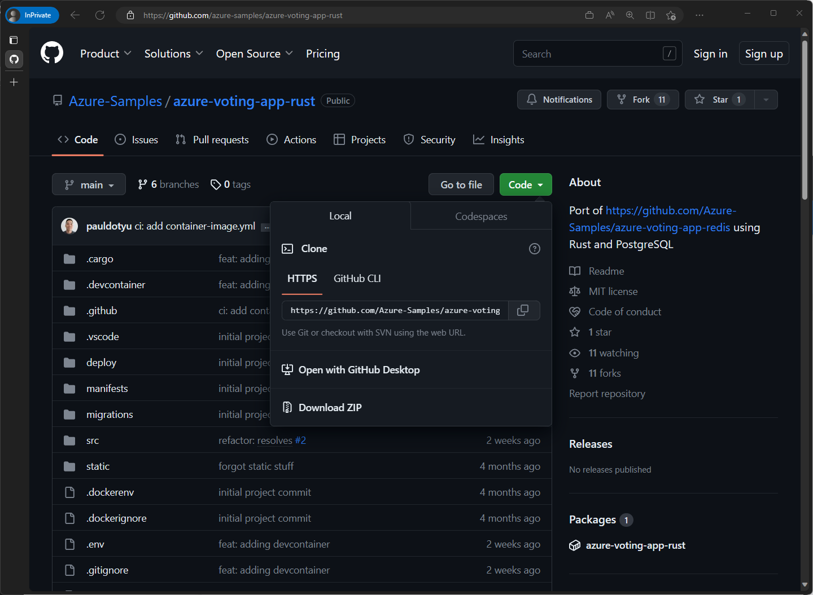
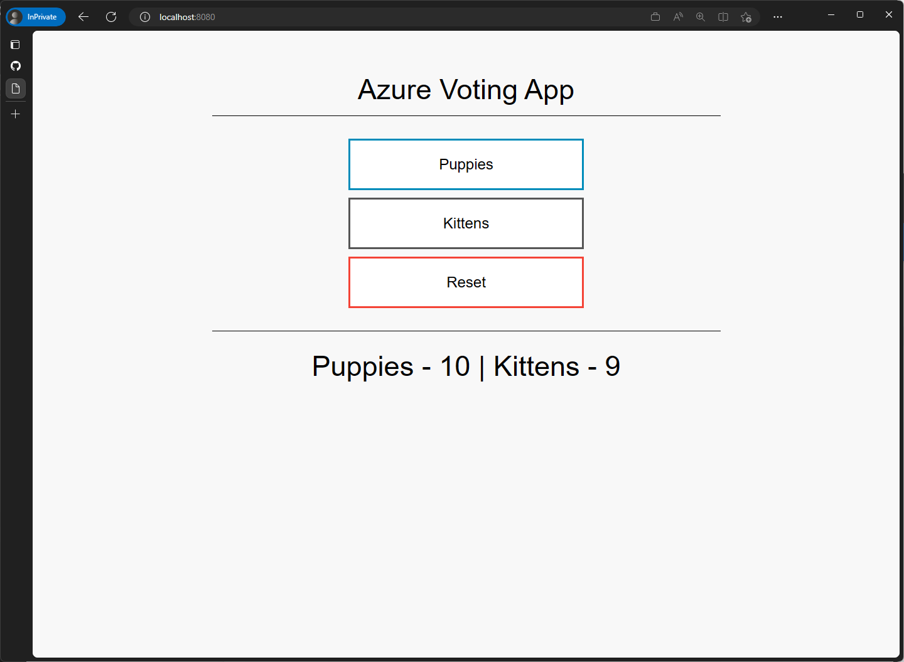
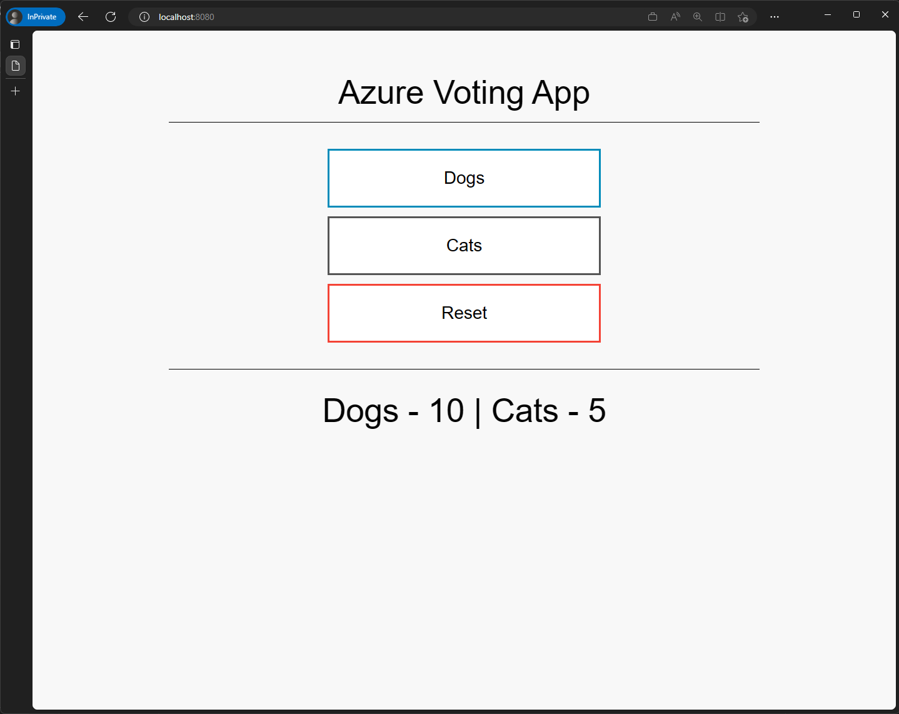

# Before we begin

## Prerequisites

Your lab environment has been pre-configured with the following:

- [Azure Subscription](https://azure.microsoft.com/free)
- [Azure CLI](https://learn.microsoft.com/cli/azure/what-is-azure-cli)
- [Visual Studio Code](https://code.visualstudio.com/)
- [Docker Desktop](https://www.docker.com/products/docker-desktop/)
- [Git](https://git-scm.com/)

Using the login credentials provided to you, login to the [Azure Portal](https://portal.azure.com).

Then, using your terminal, login to the Azure CLI using the following command:

```bash
az login
```

This command should open up a browser window and prompt you to login to Azure. Once you have logged in, you can close the browser window and return to your terminal.

## Workshop instructions

When you see these blocks of text, you should follow the instructions below.

<div class="task" data-title="Task">

> This means you need to perform a task.

</div>

<div class="info" data-title="Info">

> This means there's some additional context.

</div>

<div class="tip" data-title="Tip">

> This means you should pay attention to some helpful tips.

</div>

<div class="warning" data-title="Warning">

> This means you should pay attention to some information.

</div>

<div class="important" data-title="Important">

> This means you should **_really_** pay attention to some information.

</div>

---

# Kubernetes fundamentals

This section of the workshop will introduce you to the basics of Kubernetes. We'll be using [Azure Kubernetes Service (AKS)](https://azure.microsoft.com/products/kubernetes-service) to deploy and manage an [Azure Voting App](https://github.com/Azure-Samples/azure-voting-app-rust).

## Working with `kubectl`

Kubernetes administartors will commonly interact with the Kuberetes API server using the [`kubectl` command line tool](https://kubernetes.io/docs/reference/kubectl/). As you progress through your cloud natvie journey, you will find that there are other tools available for deploying, managing, and monitoring Kubernetes clusters. However, basic knowledge of `kubectl` is essential.

### Connecting to your AKS cluster

An AKS cluster has been provisioned for you. Let's use the Azure CLI to download the credentials for the cluster.

<div class="task" data-title="Task">

> Replace `<resource-group>` and `<cluster-name>` in the command below with the values provided to you and run it to download the credentials for your AKS cluster.

</div>

```bash
RG_NAME=<resource-group>
AKS_NAME=<cluster-name>
az aks get-credentials --resource-group $RG_NAME --name $AKS_NAME
```

The command above will download the credentials for the cluster and store them in `~/.kube/config`. This file includes cluster certificate information and is used by `kubectl` to connect to the cluster. Since it does contain certificate information, it should be treated as a secret.

### `kubectl` basics

<div class="task" data-title="Task">

> To get some basic information about your cluster, run the following command:

</div>

```bash
kubectl cluster-info
```

The `kubectl` tool allows to you to interact with a variety of Kubernetes clusters.

<div class="tip" data-title="Tip">

> You can see the list of clusters you have access to by running the following command:

</div>

```bash
kubectl config get-contexts
```

<div class="tip" data-title="Tip">

> If you have more than one context listed, you can switch between clusters by running the following command:

</div>

```bash
kubectl config use-context <context-name>
```

<div class="tip" data-title="Tip">

> Be sure to checkout the [`kubectl` Cheat Sheet](https://kubernetes.io/docs/reference/kubectl/cheatsheet/) for a list of common commands.

</div>

## Deploying your first app

The `kubectl` tool allows you to interact with the Kubernetes API server imperatively or declaratively. When you use the imperative approach, you are telling Kubernetes what to do. When you use the declarative approach, you are telling Kubernetes what you want.

<div class="task" data-title="Task">

> Let's deploy our first app to Kubernetes using the imperative approach.

</div>

```bash
kubectl run nginx --image nginx
```

Here, we are telling Kubernetes to run a new Pod named `nginx` using the `nginx` image.

A Pod is the smallest unit of deployment in Kubernetes. It is a group of one or more containers that share the same network and storage. In this case, we are running a single container using the `nginx` image.

<div class="info" data-title="Info">

> When you run multiple containers in a Pod, this is known as a [sidecar pattern](https://docs.microsoft.com/azure/architecture/patterns/sidecar).

</div>

<div class="task" data-title="Task">

> Let's see if our Pod is running.

</div>

```bash
kubectl get pods
```

<details>
<summary>Click to expand output</summary>

You should see something like this:

```text
NAME    READY   STATUS    RESTARTS   AGE
nginx   1/1     Running   0          7s
```

</details>

<div class="task" data-title="Task">

> We can also get more information about our Pod by running the following command:

</div>

```bash
kubectl describe pod nginx
```

This command will give us a lot of information about our Pod including the events that have occurred.

<div class="task" data-title="Task">

> To view container logs, run the following command:

</div>

```bash
kubectl logs nginx
```

Now, let's take a look at how we can deploy our app using a declarative approach.

<div class="task" data-title="Task">

> Let's create a YAML manifest that describes our Pod.

</div>

```bash
cat <<EOF > nginx2.yaml
apiVersion: v1
kind: Pod
metadata:
  name: nginx2
spec:
  containers:
  - name: nginx2
    image: nginx
    resources: {}
EOF
```

[YAML](https://yaml.org/) is a human-readable data serialization language. It is commonly used for configuration files and in applications where data is being stored or transmitted. YAML is short for "YAML Ain't Markup Language".

<div class="info" data-title="Info">

> The deployment details are specified in a YAML file which was passed in using [here-doc](https://linuxize.com/post/bash-heredoc/) syntax. This is a common pattern for creating YAML files in Bash scripts.

</div>

<div class="task" data-title="Task">

> Next, let's deploy our Pod using the YAML manifest we just created. Don't worry if you don't understand the YAML file. We'll be covering that in more detail later.

</div>

```bash
kubectl apply -f nginx2.yaml
kubectl get pods
```

<details>
<summary>Click to expand output</summary>

You should see something like this:

```text
NAME     READY   STATUS    RESTARTS   AGE
nginx    1/1     Running   0          7m49s
nginx2   1/1     Running   0          3s
```

</details>

Here, we are telling Kubernetes that we want a Pod named `nginx2` using the `nginx` image.

This is different from the imperative approach where we told Kubernetes to run a Pod named `nginx` using the `nginx` image. The declarative approach is preferred because it allows us to check our code into source control and track changes over time.

The `kubectl apply` command is idempotent. This means that if you run the command multiple times, the result will be the same. If the resource already exists, it will be updated. If the resource does not exist, it will be created.

<div class="important" data-title="Important">

> Before we move on, be sure to delete all pods so that we don't waste cluster resources.

</div>

```bash
kubectl delete pods --all
```

---

# Deploying to AKS

We'll be deploying the Azure Voting App to Azure Kubernetes Service (AKS). This is a simple web app that lets you vote for things and displays the vote totals. You may recognize this app from Microsoft Docs which allows you to vote for "Dogs" or "Cats". The example we'll be using is a slightly different in that it's been modified to allow you to vote for any two things you want based on the environment variables you set... and written in Rust 🦀

The repo can be found here: [Azure-Samples/azure-voting-app-rust](https://github.com/Azure-Samples/azure-voting-app-rust).

## Getting familiar with Azure Voting App

As the name suggests, the app uses PostgreSQL as the backend database. We'll be using Docker to package the app into a container image so that it can be deployed to AKS.

<div class="task" data-title="Task">

> Start off by forking, then cloning the repo to your local machine. When the repo has been cloned, open it up in VS Code.

</div>



<div class="task" data-title="Task">

> Before we deploy the app to AKS, let's build and run it locally to make sure everything is working as expected.

</div>

```bash
docker-compose up
```

<div class="warning" data-title="Warning">

> This command will take a few minutes to complete. The first time you run it, Docker will need to download the base images and build the app. Subsequent runs will be much faster.

</div>

Once the app is running, you should be able to access it at http://localhost:8080.



If you look at the `docker-compose.yml` file, you'll see that the app is made up of two services: `app` and `db`. As the names suggest, the `app` service is the web front-end and the `db` service is the database. In the `app` service, you'll see that there are two environment variables defined: `FIRST_VALUE` and `SECOND_VALUE`. These are the options that will be displayed on the voting page.

## Publishing the app to Azure Container Registry

Before you can deploy our app to Kubernetes, you need to package the container image and push it to a container registry. You'll be using [Azure Container Registry (ACR)](https://azure.microsoft.com/products/container-registry) for this.

There are a few different ways to push an image to ACR. We'll be using the `az acr build` command which will use [ACR Tasks](https://learn.microsoft.com/azure/container-registry/container-registry-tasks-overview) to build the image and push it to ACR.

<div class="task" data-title="Task">

> Let's start by getting the name of your ACR instance. Be sure to replace `<resource-group>` with the name of your resource group.

</div>

```bash
RG_NAME=<resource-group>

# get the name of the ACR instance
ACR_NAME=$(az resource list \
  --resource-group $RG_NAME \
  --resource-type Microsoft.ContainerRegistry/registries \
  --query "[0].name" \
  --output tsv)
```

<div class="task" data-title="Task">

> Make sure you are at the root of your repository then run the following command to build and push the image to ACR.

</div>

```bash
az acr build \
  --registry $ACR_NAME \
  --image azure-voting-app:latest \
  --file Dockerfile \
  .
```

<div class="important" data-title="Important">

> This command will take a few minutes to complete. Let's move on to the next step while it's running.

</div>

## Creating your first YAML Deployment

Earlier, we learned that Kubernetes uses YAML manifests to describe the state of your cluster.

In the previous secion, we used `kubectl` to run a pod using both the imperative and declarative approaches. 

But, did you know that `kubectl` can also be used to generate YAML manifests for you? Let's take a look at how we can do that to generate a YAML file for our app.

<div class="task" data-title="Task">

> Open a new terminal and make sure you are at the root of the repo then run the following command to generate a YAML file for our app. Don't forget to replace `<resource-group>` with your resource group name.

</div>

```bash
# set the resource group name again since we are in a new terminal
RG_NAME=<resource-group>

# set the name of the ACR instance again since we are in a new terminal
ACR_NAME=$(az resource list \
  --resource-group $RG_NAME \
  --resource-type Microsoft.ContainerRegistry/registries \
  --query "[0].name" \
  --output tsv)

# generate the YAML file
kubectl create deploy azure-voting-app \
  --image $ACR_NAME.azurecr.io/azure-voting-app:latest \
  --port=8080 \
  --dry-run=client \
  --output yaml > azure-voting-app-deployment.yaml
```

The `--dry-run=client` flag combined with the `--output yaml` flag tells `kubectl` to generate the YAML file but not actually run the command. This is useful because it allows us to see what the YAML file will look like before we actually run it. By redirecting the output to a file, we can save the YAML file to disk. If you open up the YAML file, you'll see that most of the details have been filled in for you 🥳

Did you notice that we are creating a **Deployment** resource instead of a **Pod** resource? This is because we want to scale our app up and down. If we were to use a Pod resource, we can only run a single instance of it.

## Configuring apps using environment variables

The base YAML file that was generated for us is a good starting point, but we need to make a few changes to it before we can deploy it to AKS. The first thing we need to do is add the environment variables to configure the app.

But wait, we don't know where exactly to put the environment variables in the YAML file. Never fear, `kubectl` is here!

<div class="task" data-title="Task">

> Run the following `kubectl explain` command to get more information about Deployments.

</div>

```bash
kubectl explain deploy.spec.template.spec.containers
```

Here we are using `kubectl explain` to get information about the Deployment resource. We are then drilling down into the `spec.template.spec.containers` section to get information about the `containers` property.

<div class="info" data-title="Info">

> You can traverse the through all the Deployment properties in this way to get more information about them. Additionally, you can also use `kubectl explain` to get more information about other Kubernetes resources.
>
> To see a list of all resources that can be explained, run the following command:

</div>

```bash
kubectl api-resources
```

<div class="task" data-title="Task">

> We can see that the `containers` object has a `env` property which is an array of environment variables. If we dig a little deeper, we can see how to define environment variables.

</div>

```bash
kubectl explain deploy.spec.template.spec.containers.env
```

<div class="task" data-title="Task">

> Now that we know where to put the environment variables, let's add them to the YAML file. Open the `azure-voting-app-deployment.yaml` file, place your cursor after the `resource: {}` line, and add the following block of code.

</div>

```yaml
env:
  - name: FIRST_VALUE
    value: "Dogs"
  - name: SECOND_VALUE
    value: "Cats"
```

<div class="important" data-title="Important">

> YAML is very sensitive to indentation. Make sure you indent the environment variables exactly as its shown above. The resulting YAML file should look like this:

</div>

<details>
<summary>Click to expand output</summary>

```yaml
apiVersion: apps/v1
kind: Deployment
metadata:
  creationTimestamp: null
  labels:
    app: azure-voting-app
  name: azure-voting-app
spec:
  replicas: 1
  selector:
    matchLabels:
      app: azure-voting-app
  strategy: {}
  template:
    metadata:
      creationTimestamp: null
      labels:
        app: azure-voting-app
    spec:
      containers:
        - image: <REPLACE_THIS_WITH_YOUR_ACR_NAME>.azurecr.io/azure-voting-app:latest
          name: azure-voting-app
          resources: {}
          env:
            - name: FIRST_VALUE
              value: "Dogs"
            - name: SECOND_VALUE
              value: "Cats"
            - name: DATABASE_SERVER
              value: azure-voting-db
            - name: DATABASE_PASSWORD
              valueFrom:
                secretKeyRef:
                  name: azure-voting-db-secrets
                  key: password
status: {}
```

</details>

## Securing credentials using "Secrets"

We also need database credentials to be able to connect to the database. We could add them to the YAML file, but that would mean that they would be stored in plain text. This is not a good idea because anyone who has access to the YAML file would be able to see the credentials. Instead, we are going to use a [Kubernetes secret](https://kubernetes.io/docs/concepts/configuration/secret/) to store the credentials.

<div class="task" data-title="Task">

> Run the following command to create a secret for the database credentials.

</div>

```bash
kubectl create secret generic azure-voting-db-secrets \
  --from-literal=username=postgres \
  --from-literal=password=mypassword
```

Now that we have created the secret, we need to tell Kubernetes to use it. We can do this by adding a `valueFrom` property to the `containers` object.

<div class="task" data-title="Task">

> In the `azure-voting-app-deployment.yaml` file, add the following YAML to the YAML file directly below the `SECOND_VALUE` environment variable.

</div>

```yaml
- name: DATABASE_SERVER
  value: azure-voting-db
- name: DATABASE_USER
  valueFrom:
    secretKeyRef:
      name: azure-voting-db-secrets
      key: username
- name: DATABASE_PASSWORD
  valueFrom:
    secretKeyRef:
      name: azure-voting-db-secrets
      key: password
```

<div class="info" data-title="Info">

> Your `azure-voting-app-deployment.yaml` file should now look like this:

</div>

<details>
<summary>Click to expand output</summary>

```yaml
apiVersion: apps/v1
kind: Deployment
metadata:
  creationTimestamp: null
  labels:
    app: azure-voting-app
  name: azure-voting-app
spec:
  replicas: 1
  selector:
    matchLabels:
      app: azure-voting-app
  strategy: {}
  template:
    metadata:
      creationTimestamp: null
      labels:
        app: azure-voting-app
    spec:
      containers:
        - image: <REPLACE_THIS_WITH_YOUR_ACR_NAME>.azurecr.io/azure-voting-app:latest
          name: azure-voting-app
          ports:
            - containerPort: 8080
          resources: {}
          env:
            - name: FIRST_VALUE
              value: "Dogs"
            - name: SECOND_VALUE
              value: "Cats"
            - name: DATABASE_SERVER
              value: "azure-voting-db"
            - name: DATABASE_USER
              valueFrom:
                secretKeyRef:
                  name: azure-voting-db-secrets
                  key: username
            - name: DATABASE_PASSWORD
              valueFrom:
                secretKeyRef:
                  name: azure-voting-db-secrets
                  key: password
status: {}
```

</details>

We're nearly there. We just need to configure the PostgreSQL database deployment. The process of creating the YAML will be very similar to what we did for the Azure Voting App deployment.

<div class="task" data-title="Task">

> Using `kubectl`, create a file called `azure-voting-db-deployment.yaml`.

</div>

```base
kubectl create deployment azure-voting-db \
  --image=postgres \
  --dry-run=client \
  -o yaml > azure-voting-db-deployment.yaml
```

<div class="task" data-title="Task">

> Open the `azure-voting-db-deployment.yaml` file and add the following YAML to it (just below the `resources` property).

</div>

```yaml
env:
  - name: POSTGRES_USER
    valueFrom:
      secretKeyRef:
        name: azure-voting-db-secrets
        key: username
  - name: POSTGRES_PASSWORD
    valueFrom:
      secretKeyRef:
        name: azure-voting-db-secrets
        key: password
```

<div class="info" data-title="Info">

> Your `azure-voting-db-deployment.yaml` file should now look like this:

</div>

<details>
<summary>Click to expand output</summary>

```yaml
apiVersion: apps/v1
kind: Deployment
metadata:
  creationTimestamp: null
  labels:
    app: azure-voting-db
  name: azure-voting-db
spec:
  replicas: 1
  selector:
    matchLabels:
      app: azure-voting-db
  strategy: {}
  template:
    metadata:
      creationTimestamp: null
      labels:
        app: azure-voting-db
    spec:
      containers:
        - image: postgres
          name: postgres
          resources: {}
          env:
            - name: POSTGRES_USER
              valueFrom:
                secretKeyRef:
                  name: azure-voting-db-secrets
                  key: username
            - name: POSTGRES_PASSWORD
              valueFrom:
                secretKeyRef:
                  name: azure-voting-db-secrets
                  key: password
status: {}
```

</details>

<div class="task" data-title="Task">

> Run the following command to create the PostgreSQL database deployment.

</div>

```bash
kubectl apply -f azure-voting-db-deployment.yaml
```

## Exposing Deployments with Services

With the database deployed in a pod, the front end application will need to be able to connect to it. We could use the Pod IP to connect to that will not be resilient since Pods are ephemeral and are given random IP addresses as they are created. So we'll need to create a [Service](https://kubernetes.io/docs/concepts/services-networking/service/) for the PostgreSQL database. Think of a service like an internal load balancer. This will give the front end app a single point of entry to connect to the database.

We can create a service imperatively using the `kubectl expose` command and specifying the deployment name. However, we should use the same technique of creating a YAML file and then modifying it to suit our needs.

<div class="task" data-title="Task">

> Run the following command to create a service for the PostgreSQL database deployment.

</div>

```bash
# create the YAML file
kubectl expose deployment azure-voting-db \
  --port=5432 \
  --target-port=5432 \
  --name=azure-voting-db \
  --dry-run=client \
  -o yaml > azure-voting-db-service.yaml

# deploy the YAML file
kubectl apply -f azure-voting-db-service.yaml
```

<div class="task" data-title="Task">

> Run the following command to create a service for the Azure Voting App.

</div>

```bash
kubectl apply -f azure-voting-app-deployment.yaml
```

<div class="task" data-title="Task">

> Run the following command to create a service for the Azure Voting App deployment.

</div>

```bash
# create the YAML file
kubectl expose deployment azure-voting-app \
  --port=8080 \
  --target-port=8080 \
  --name=azure-voting-app \
  --dry-run=client \
  -o yaml > azure-voting-app-service.yaml

# deploy the YAML file
kubectl apply -f azure-voting-app-service.yaml
```

Now that we have deployed the Azure Voting App and the PostgreSQL database, we can check to see if they are running.

```bash
kubectl get deployments,pods,services
```

<details>
<summary>Click to expand output</summary>

```text
NAME                               READY   UP-TO-DATE   AVAILABLE   AGE
deployment.apps/azure-voting-app   1/1     1            1           27m
deployment.apps/azure-voting-db    1/1     1            1           27m

NAME                                    READY   STATUS    RESTARTS   AGE
pod/azure-voting-app-6bc9446ddb-xvdgc   1/1     Running   0          10m
pod/azure-voting-db-5666f7fc58-nph78    1/1     Running   0          27m

NAME                       TYPE        CLUSTER-IP   EXTERNAL-IP   PORT(S)    AGE
service/azure-voting-app   ClusterIP   10.0.185.0   <none>        8080/TCP   22s
service/azure-voting-db    ClusterIP   10.0.13.23   <none>        5432/TCP   3m
service/kubernetes         ClusterIP   10.0.0.1     <none>        443/TCP    171m
```

</details>

The application and services are now running, but we can't access it yet. If you noticed, there is no way to access the application from outside the cluster. We can temporarily connect to the service by using the `kubectl port-forward` command for now.

<div class="task" data-title="Task">

> Run the following command to expose the application.

</div>

```bash
kubectl port-forward service/azure-voting-app 8080:8080
```

<div class="info" data-title="Info">

> Kubernetes will now forward all traffic from port 8080 on your local machine to port 8080 on the `azure-voting-app` service.

</div>

Now that we have exposed the application, we can access it from our local machine. Open a browser and go to `http://localhost:8080`. You should see the Azure Voting App.



<div class="task" data-title="Task">

> Press `Ctrl+C` to stop the port forwarding. We'll expose the application in a more permanent way later.

</div>

---

## Dealing with secrets

The dirty secret about Kubernetes secrets is that they are not really secrets. They are just base64 encoded strings. Anyone with access to the cluster can decode them and see what they are. This is not a problem if you are using a private cluster, but anyone with access to your cluster can see your secrets.

<div class="task" data-title="Task">

> Run the following command to get the `password` secret we saved in the cluster.

</div>

```bash
kubectl get secrets azure-voting-db-secrets -o jsonpath='{.data.password}'
```

Notice the output. It's just a base64 encoded string. We can decode it by using the `base64` command.

<div class="task" data-title="Task">

> Run the following command to decode the `password` secret.

</div>

```bash
kubectl get secrets azure-voting-db-secrets -o jsonpath='{.data.password}' | base64 --decode
```

There it is.. the secret is out. Anyone with access to the cluster can see the secret 😨

<div class="task" data-title="Task">

> Run the following command to delete the `azure-voting-db-secrets` secret. We'll create a new one next.

</div>

```bash
kubectl delete secret azure-voting-db-secrets
```

### Securely storing secrets

There are a few ways to store secrets in a more secure way. One way is to use [Azure Key Vault](https://azure.microsoft.com/services/key-vault/).

Your lab environment already has an Azure Key Vault created for you.

<div class="task" data-title="Task">

> Run the following command to get the name of your Azure Key Vault.

</div>

```bash
AKV_NAME=$(az resource list \
--resource-group $RG_NAME \
--resource-type Microsoft.KeyVault/vaults \
--query "[0].name" -o tsv)
```

With the name of your Azure Key Vault, you can now store your secrets in the Azure Key Vault.

<div class="task" data-title="Task">

> Run the following command to store the database username and password in the Azure Key Vault.

</div>

```bash
az keyvault secret set \
  --vault-name $AKV_NAME \
  --name database-user \
  --value postgres

az keyvault secret set \
  --vault-name $AKV_NAME \
  --name database-password \
  --value postgres
```

### Using the Azure Key Vault secrets in Kubernetes

You AKS cluster has also been provisioned with the [Secret Store CSI driver](https://secrets-store-csi-driver.sigs.k8s.io/) addon. This allows you to mount secrets from the Azure Key Vault as [volumes](https://kubernetes.io/docs/concepts/storage/volumes/) in your pods.

<div class="info" data-title="Info">

> To verify that the Secret Store CSI driver addon is installed in your cluster, run the following command:

</div>

```bash
kubectl get pods \
  --namespace kube-system \
  --selector 'app in (secrets-store-csi-driver, secrets-store-provider-azure)'
```

<details>
<summary>Click to expand output</summary>

You should see something like this:

```text
NAME                                     READY   STATUS    RESTARTS   AGE
aks-secrets-store-csi-driver-dnxf5       3/3     Running   0          3m35s
aks-secrets-store-csi-driver-nf5h8       3/3     Running   0          3m35s
aks-secrets-store-csi-driver-v4bql       3/3     Running   0          3m35s
aks-secrets-store-provider-azure-82nps   1/1     Running   0          3m35s
aks-secrets-store-provider-azure-s6lbd   1/1     Running   0          3m35s
aks-secrets-store-provider-azure-tcc7f   1/1     Running   0          3m35s
```

</details>

In order to use the Secret Store CSI driver, we need to create a SecretProviderClass. This is a Kubernetes object that tells the Secret Store CSI driver which secrets to mount and where to mount them. The authentication to the Azure Key Vault will be done using [workload identity](https://learn.microsoft.com/azure/aks/csi-secrets-store-identity-access#access-with-an-azure-ad-workload-identity-preview). This means that the pod will use the managed identity of the AKS cluster to authenticate to the Azure Key Vault.

To do this, we need to create a [ServiceAccount](https://kubernetes.io/docs/concepts/security/service-accounts/) which will use the managed identity of the AKS cluster and attached to the pod. This way, if your app running in the pod, needs to access resources in Azure, it can do so using the managed identity.

<div class="task" data-title="Task">

> Run the following command to create a ServiceAccount which uses the managed identity of the AKS cluster.

</div>

```bash
# get the client id of the managed identity
USER_ASSIGNED_CLIENT_ID=$(az identity show \
  --resource-group $RG_NAME \
  --name $AKS_NAME-identity \
  --query clientId -o tsv)

# set namespace (this must align with the namespace that your app is deployed into)
SERVICE_ACCOUNT_NAMESPACE=default

# set the service account name
SERVICE_ACCOUNT_NAME=azure-voting-app-serviceaccount

# create the service account
kubectl apply -f - <<EOF
apiVersion: v1
kind: ServiceAccount
metadata:
  annotations:
    azure.workload.identity/client-id: ${USER_ASSIGNED_CLIENT_ID}
  labels:
    azure.workload.identity/use: "true"
  name: ${SERVICE_ACCOUNT_NAME}
  namespace: ${SERVICE_ACCOUNT_NAMESPACE}
EOF
```

Next, we need to create a SecretProviderClass which will tell the Secret Store CSI driver which secrets to mount and where to retrieve them from.

<div class="task" data-title="Task">

> Run the following commands to retrieve information needed to create a SecretProviderClass using a workload identity to access the key vault.

</div>

```bash
# get the client id of the managed identity
USER_ASSIGNED_CLIENT_ID=$(az identity show \
  --resource-group $RG_NAME \
  --name $AKS_NAME-identity \
  --query clientId -o tsv)

# get the name of the key vault
AKV_NAME=$(az keyvault list \
  --resource-group $RG_NAME \
  --query "[0].name" -o tsv)

# get the tenant id of the managed identity
TENANT_ID=$(az identity show \
  --resource-group $RG_NAME \
  --name $AKS_NAME-identity \
  --query tenantId -o tsv)

# create a SecretProviderClass
kubectl apply -f - <<EOF
apiVersion: secrets-store.csi.x-k8s.io/v1
kind: SecretProviderClass
metadata:
  name: azure-keyvault-secrets                 # This needs to be unique per namespace
spec:
  provider: azure
  parameters:
    usePodIdentity: "false"
    useVMManagedIdentity: "false"
    clientID: "${USER_ASSIGNED_CLIENT_ID}"     # Setting this to use workload identity
    keyvaultName: ${AKV_NAME}                  # Set to the name of your key vault
    objects:  |
      array:
        - |
          objectName: database-user            # The name of the secret in the key vault
          objectType: secret                   # The type of the secret in the key vault
        - |
          objectName: database-password
          objectType: secret
    tenantId: "${TENANT_ID}"                   # The tenant ID of the key vault
EOF
```

Finally, we need to update our database and app deployments to use the ServiceAccount and mount the secrets into each pod.

<div class="task" data-title="Task">

> Open the `azure-voting-db-deployment.yaml` file and replace your entire `env:` block with this.

</div>

```yaml
env:
  - name: POSTGRES_USER_FILE
    value: "/mnt/secrets-store/database-user"
  - name: POSTGRES_PASSWORD_FILE
    value: "/mnt/secrets-store/database-password"
```

<div class="task" data-title="Task">

> Directly underneath the `env:` block add this to mount the secrets into the container.

</div>

```yaml
volumeMounts:
  - name: azure-voting-db-secrets
    mountPath: "/mnt/secrets-store"
    readOnly: true
```

<div class="task" data-title="Task">

> Next add a new line after the `volumeMounts:` block and make sure it is indented to the same level as the `containers:` block. Add this to enable the pod to use the service account and add a volume to mount the secrets into.

</div>

```yaml
serviceAccountName: azure-voting-app-serviceaccount
  volumes:
    - name: azure-voting-db-secrets
      csi:
        driver: secrets-store.csi.k8s.io
        readOnly: true
        volumeAttributes:
          secretProviderClass: azure-keyvault-secrets
```

Your final `azure-voting-db-deployment.yaml` file should look like this.

<details>
<summary>Click to expand code</summary>

```yaml
apiVersion: apps/v1
kind: Deployment
metadata:
  creationTimestamp: null
  labels:
    app: azure-voting-db
  name: azure-voting-db
spec:
  replicas: 1
  selector:
    matchLabels:
      app: azure-voting-db
  strategy: {}
  template:
    metadata:
      creationTimestamp: null
      labels:
        app: azure-voting-db
    spec:
      containers:
        - image: postgres
          name: postgres
          resources: {}
          env:
            - name: POSTGRES_USER_FILE
              value: "/mnt/secrets-store/database-user"
            - name: POSTGRES_PASSWORD_FILE
              value: "/mnt/secrets-store/database-password"
          volumeMounts:
            - name: azure-voting-db-secrets
              mountPath: "/mnt/secrets-store"
              readOnly: true
      serviceAccountName: azure-voting-app-serviceaccount
      volumes:
        - name: azure-voting-db-secrets
          csi:
            driver: secrets-store.csi.k8s.io
            readOnly: true
            volumeAttributes:
              secretProviderClass: azure-keyvault-secrets
status: {}
```

</details>

<div class="task" data-title="Task">

> Open the `azure-voting-app-deployment.yaml` file and do the same thing for the app deployment. Replace your entire `env:` block with this.

</div>

```yaml
env:
  - name: FIRST_VALUE
    value: "Dogs"
  - name: SECOND_VALUE
    value: "Cats"
  - name: DATABASE_SERVER
    value: "azure-voting-db"
```

<div class="task" data-title="Task">

> Add this to mount the secrets into the container.

</div>

```yaml
volumeMounts:
  - name: azure-voting-db-secrets
    mountPath: "/mnt/secrets-store"
    readOnly: true
```


<div class="task" data-title="Task">

> Finally add this to enable the pod to use the service account and add a volume to mount the secrets into.

</div>

```yaml
serviceAccountName: azure-voting-app-serviceaccount
volumes:
  - name: azure-voting-db-secrets
    csi:
      driver: secrets-store.csi.k8s.io
      readOnly: true
      volumeAttributes:
        secretProviderClass: azure-keyvault-secrets
```

<details>
<summary>Click to expand code</summary>

The updated YAML to look like the following:

```yaml
apiVersion: apps/v1
kind: Deployment
metadata:
  creationTimestamp: null
  labels:
    app: azure-voting-app
  name: azure-voting-app
spec:
  replicas: 1
  selector:
    matchLabels:
      app: azure-voting-app
  strategy: {}
  template:
    metadata:
      creationTimestamp: null
      labels:
        app: azure-voting-app
    spec:
      containers:
        - image: <REPLACE_THIS_WITH_YOUR_ACR_NAME>.azurecr.io/azure-voting-app:latest
          name: azure-voting-app
          ports:
            - containerPort: 8080
          resources: {}
          env:
            - name: FIRST_VALUE
              value: "Dogs"
            - name: SECOND_VALUE
              value: "Cats"
            - name: DATABASE_SERVER
              value: "azure-voting-db"
          volumeMounts:
            - name: azure-voting-db-secrets
              mountPath: "/mnt/secrets-store"
              readOnly: true
      serviceAccountName: azure-voting-app-serviceaccount
      volumes:
        - name: azure-voting-db-secrets
          csi:
            driver: secrets-store.csi.k8s.io
            readOnly: true
            volumeAttributes:
              secretProviderClass: azure-keyvault-secrets
status: {}
```

</details>

<div class="task" data-title="Task">

> Deploy the updated YAML files to your cluster.

</div>

```bash
kubectl apply -f azure-voting-db-deployment.yaml
kubectl apply -f azure-voting-app-deployment.yaml
```

<div class="task" data-title="Task">

> Check the status of the Deployments, Pods, and Secrets. You should see the following:

</div>

```bash
kubectl get deployments,pods,services,secrets
```

<details>
<summary>Click to expand output</summary>

```text
NAME                               READY   UP-TO-DATE   AVAILABLE   AGE
deployment.apps/azure-voting-app   1/1     1            1           23m
deployment.apps/azure-voting-db    1/1     1            1           23m

NAME                                    READY   STATUS    RESTARTS   AGE
pod/azure-voting-app-756dc858f8-b4rkx   2/2     Running   0          22m
pod/azure-voting-db-59f4d48797-djt4z    2/2     Running   0          23m

NAME                       TYPE        CLUSTER-IP     EXTERNAL-IP   PORT(S)    AGE
service/azure-voting-app   ClusterIP   10.0.110.128   <none>        8080/TCP   10h
service/azure-voting-db    ClusterIP   10.0.58.27     <none>        5432/TCP   10h
service/kubernetes         ClusterIP   10.0.0.1       <none>        443/TCP    12h
```

</details>

<div class="info" data-title="Info">

> Did you notice we don't have any secrets in the cluster anymore? This is because the secrets were pulled from Azure KeyVault using the Secrets Store CSI driver and mounted into the pods. The secrets end up as files in the pod's file system in the `/mnt/secrets-store` directory. The app and database containers can read the secrets from the files. The container that we built to host the app does not have shell access so no one can read the secrets from the files other than the app and database containers.

</div>

<div class="task" data-title="Task">

> Run the following command to enable port forwarding to the app service again to see if the app is working.

</div>

```bash
kubectl port-forward service/azure-voting-app 8080:8080
```

Open a browser and navigate to http://localhost:8080. You should see the voting app is working again.

---

## Persisting data

Databases need to store data but pods are ephemeral. If the database pod is deleted or restarted, the data will be lost. Let's see how we can use persistent storage to solve this problem.

Let's see when we restart the database and app pods.

<div class="task" data-title="Task">

> Run the following command to delete the database and app pods. Kubernetes will automatically restart them.

</div>

```bash
kubectl delete pod --all
```

Wait for the pods to restart and then run the `kubectl port-forward` command again, and refresh the browser. You should see that the votes have been reset to 0 😭

### Using Azure Disk for PGDATA

This can be solved by leveraging persistent storage; more specifically, by taking advantage of the [Azure CSI drivers and storage classes](https://learn.microsoft.com/azure/aks/csi-storage-drivers) that have been pre-deployed into your cluster.

<div class="task" data-title="Task">

> Run the following command to see the storage classes that are available in your cluster.

</div>

```bash
kubectl get storageclasses
```

<details>
<summary>Click to expand output</summary>

```text
NAME                    PROVISIONER          RECLAIMPOLICY   VOLUMEBINDINGMODE      ALLOWVOLUMEEXPANSION   AGE
azurefile               file.csi.azure.com   Delete          Immediate              true                   5h22m
azurefile-csi           file.csi.azure.com   Delete          Immediate              true                   5h22m
azurefile-csi-premium   file.csi.azure.com   Delete          Immediate              true                   5h22m
azurefile-premium       file.csi.azure.com   Delete          Immediate              true                   5h22m
default (default)       disk.csi.azure.com   Delete          WaitForFirstConsumer   true                   5h22m
managed                 disk.csi.azure.com   Delete          WaitForFirstConsumer   true                   5h22m
managed-csi             disk.csi.azure.com   Delete          WaitForFirstConsumer   true                   5h22m
managed-csi-premium     disk.csi.azure.com   Delete          WaitForFirstConsumer   true                   5h22m
managed-premium         disk.csi.azure.com   Delete          WaitForFirstConsumer   true                   5h22m
```

</details>

Typically for persistent storage, you would create a [Persistent Volume (PV)](https://kubernetes.io/docs/concepts/storage/persistent-volumes/) and [Persistent Volume Claim (PVC)](https://kubernetes.io/docs/concepts/storage/persistent-volumes/#persistentvolumeclaims) to request storage. However, the Azure CSI drivers allow you to create a PVC and have the driver create the Azure Storage-backed PV for you.

<div class="task" data-title="Task">

> Open the `azure-voting-db-deployment.yaml` file and add the following YAML at the top of the file.

</div>

```yaml
apiVersion: v1
kind: PersistentVolumeClaim
metadata:
  name: pvc-azuredisk
spec:
  accessModes:
    - ReadWriteOnce
  resources:
    requests:
      storage: 10Gi
  storageClassName: managed-csi-premium
---
```

<div class="info" data-title="Info">

> Notice the YAML ended with a `---`, which is a YAML separator. This allows us to define multiple resources in a single file.

</div>

### Updating the Deployment manifest to use the PVC

With the PVC created, we can now update the Deployment manifest to use it.

<div class="task" data-title="Task">

> In the Deployment manifest, add a volume to the pod definition. You should already have a `volumes` section in the YAML. Add the following YAML to the end of the `volumes` section.

</div>

```yaml
- name: azure-voting-db-data
  persistentVolumeClaim:
    claimName: pvc-azuredisk
```

<div class="task" data-title="Task">

> Also in the Deployment manifest, add a volume mount to the container definition. You should already have a `volumeMounts` section in the YAML. Add the following YAML to the end of the `volumeMounts` section.
>
> NOTE: The `subPath` property allows us to mount a subdirectory of the volume into the container.

```yaml
- name: azure-voting-db-data
  mountPath: "/var/lib/postgresql/data"
  subPath: "data"
```

<div class="info" data-title="Info">

> Your `azure-voting-db-deployment.yaml` file should look like this:

</div>

<details>
<summary>Click to expand code</summary>

```yaml
apiVersion: v1
kind: PersistentVolumeClaim
metadata:
  name: pvc-azuredisk
spec:
  accessModes:
    - ReadWriteOnce
  resources:
    requests:
      storage: 10Gi
  storageClassName: managed-csi-premium
---
apiVersion: apps/v1
kind: Deployment
metadata:
  creationTimestamp: null
  labels:
    app: azure-voting-db
  name: azure-voting-db
spec:
  replicas: 1
  selector:
    matchLabels:
      app: azure-voting-db
  strategy: {}
  template:
    metadata:
      creationTimestamp: null
      labels:
        app: azure-voting-db
    spec:
      containers:
        - image: postgres
          name: postgres
          resources: {}
          env:
            - name: POSTGRES_USER_FILE
              value: "/mnt/secrets-store/database-user"
            - name: POSTGRES_PASSWORD_FILE
              value: "/mnt/secrets-store/database-password"
          volumeMounts:
            - name: azure-voting-db-secrets
              mountPath: "/mnt/secrets-store"
              readOnly: true
            - name: azure-voting-db-data
              mountPath: "/var/lib/postgresql/data"
              subPath: "data"
      serviceAccountName: azure-voting-app-serviceaccount
      volumes:
        - name: azure-voting-db-secrets
          csi:
            driver: secrets-store.csi.k8s.io
            readOnly: true
            volumeAttributes:
              secretProviderClass: azure-keyvault-secrets
        - name: azure-voting-db-data
          persistentVolumeClaim:
            claimName: pvc-azuredisk
status: {}
```

</details>

<div class="task" data-title="Task">

> Run the following command to deploy the updated manifest.

</div>

```bash
kubectl apply -f azure-voting-db-deployment.yaml
```

<div class="task" data-title="Task">

> Run the following command to see the status of the PVC.

</div>

```bash
kubectl get pvc
```

<details>
<summary>Click to expand output</summary>

You should see the following output with a `STATUS` of `Bound`. This means the PVC has been successfully created and is ready to be used by the pod.

```bash
NAME            STATUS   VOLUME                                     CAPACITY   ACCESS MODES   STORAGECLASS          AGE
pvc-azuredisk   Bound    pvc-e25b6853-21c9-493c-8d19-f4bae2e29be8   10Gi       RWO            managed-csi-premium   2m9s
```

</details>

<div class="task" data-title="Task">

> Use the `kubectl port-forward` command to access the app again. Refresh the browser, add some votes, then delete the pods as we did at the beginning of this section. When you refresh the browser, you should see that the vote data has persisted even though the pods were deleted.

</div>

---

## Sharing your app with the world

Up until now, we've been accessing our app using port forwarding. This is great for testing, but not very useful if you want users to use your app.

To expose your app to users, we can leaverage the newly announced [Istio service mesh add-on for AKS](https://learn.microsoft.com/azure/aks/istio-deploy-addon). Istio is a service mesh that provides a lot of useful features, including [security, observability, traffic management, and more](https://istio.io/latest/docs/concepts/). We won't be using all the features of Istio, We will however, leverage the [Ingress Gateway](https://istio.io/latest/docs/tasks/traffic-management/ingress/ingress-control/) to expose our app outside of the cluster.

### Setting up Istio

The Istio add-on has already been installed in your AKS cluster with an external ingress gateway enabled.

<div class="info" data-title="Info">

> If you run the following command, you should see the Ingress Gateway service has been provisioned using a Load Balancer and it has an external IP address.

</div>

```bash
kubectl get service -n aks-istio-ingress
```

<details>
<summary>Click to expand output</summary>

Note the `NAME` and `EXTERNAL-IP` of the service. The `NAME` will be used when we create our Istio resources to expose our app and the `EXTERNAL-IP` address will be used to access our app.

```text
NAME                                TYPE           CLUSTER-IP     EXTERNAL-IP     PORT(S)                                      AGE
aks-istio-ingressgateway-external   LoadBalancer   10.0.182.197   20.252.61.166   15021:30831/TCP,80:30738/TCP,443:31546/TCP   40m
```

</details>

Istio works by injecting a sidecar container into each pod. This sidecar container is responsible for handling all the traffic to and from containers in the pod. This sidecar can be manually injected in your deployments or you can tell Istio to automatically inject Istio sidecars.

<div class="task" data-title="Task">

> Label the `default` namespace so that Istio will automatically inject the sidecar into our pods.

</div>

```bash
kubectl label namespace default istio.io/rev=asm-1-17
```

Our deployments do not have a sidecar container. Let's reploy our manifests to trigger Istio to inject sidecar containers into our pods.

<div class="task" data-title="Task">

> Run the following commands to delete and re-deploy the app.

</div>

```bash
kubectl delete deploy --all
kubectl apply -f azure-voting-db-deployment.yaml
kubectl apply -f azure-voting-app-deployment.yaml
```

<div class="info" data-title="Info">

> Run the following command to see the status of the pods. You should now wee each pod is running two containers, the app container and the Istio sidecar container.

</div>

```bash
kubectl get pods
```

<details>
<summary>Click to expand output</summary>

```text
NAME                                READY   STATUS    RESTARTS   AGE
azure-voting-app-7584b76bd5-mwg4q   2/2     Running   0          69s
azure-voting-db-8467b69b99-dg95g    2/2     Running   0          79s
```

</details>

### Exposing the app using the Ingress Gateway

Now that we have Istio installed and our app is running with the Istio sidecar, we can expose our app to the world using the Ingress Gateway. To do this, we need to implement two custom resources that got installed in the AKS cluster when Istio was installed. We will use the [Gateway](https://istio.io/latest/docs/reference/config/networking/gateway/) and [Virtual Service](https://istio.io/latest/docs/reference/config/networking/virtual-service/) resources to route traffic to our app.

<div class="task" data-title="Task">

> Open the `azure-voting-app-service.yaml` file and add the following lines to the end of it.

</div>

```yaml
---
apiVersion: networking.istio.io/v1alpha3
kind: Gateway
metadata:
  name: azure-voting-app-gateway
spec:
  selector:
    istio: aks-istio-ingressgateway-external
  servers:
    - port:
        number: 80
        name: http
        protocol: HTTP
      hosts:
        - "*"
---
apiVersion: networking.istio.io/v1alpha3
kind: VirtualService
metadata:
  name: azure-voting-app-virtualservice
spec:
  hosts:
    - "*"
  gateways:
    - azure-voting-app-gateway
  http:
    - route:
        - destination:
            host: azure-voting-app
            port:
              number: 8080
```

Here, we are creating a `Gateway` resource that will route traffic to our app using the `aks-istio-ingressgateway-external` service. The gateway will listen on port 80 and route traffic to any host. Next, we create a `VirtualService` resource that will route traffic to our backend `Service` resource using the Gateway resource we just created.

<div class="info" data-title="Info">

> Your `azure-voting-db-deployment.yaml` file should look like this:

</div>

<details>
<summary>Click to expand code</summary>

```yaml
apiVersion: apps/v1
kind: Deployment
metadata:
  creationTimestamp: null
  labels:
    app: azure-voting-app
  name: azure-voting-app
spec:
  replicas: 1
  selector:
    matchLabels:
      app: azure-voting-app
  strategy: {}
  template:
    metadata:
      creationTimestamp: null
      labels:
        app: azure-voting-app
    spec:
      containers:
        - image: acruser197.azurecr.io/azure-voting-app:v1
          name: azure-voting-app
          ports:
            - containerPort: 8080
          resources: {}
          env:
            - name: FIRST_VALUE
              value: "Dogs"
            - name: SECOND_VALUE
              value: "Cats"
            - name: DATABASE_SERVER
              value: "azure-voting-db"
          volumeMounts:
            - name: azure-voting-db-secrets
              mountPath: "/mnt/secrets-store"
              readOnly: true
      serviceAccountName: azure-voting-app-serviceaccount
      volumes:
        - name: azure-voting-db-secrets
          csi:
            driver: secrets-store.csi.k8s.io
            readOnly: true
            volumeAttributes:
              secretProviderClass: azure-keyvault-secrets
status: {}
---
apiVersion: networking.istio.io/v1alpha3
kind: Gateway
metadata:
  name: azure-voting-app-gateway
spec:
  selector:
    istio: aks-istio-ingressgateway-external
  servers:
    - port:
        number: 80
        name: http
        protocol: HTTP
      hosts:
        - "*"
---
apiVersion: networking.istio.io/v1alpha3
kind: VirtualService
metadata:
  name: azure-voting-app-virtualservice
spec:
  hosts:
    - "*"
  gateways:
    - azure-voting-app-gateway
  http:
    - route:
        - destination:
            host: azure-voting-app
            port:
              number: 8080

```

</details>

<div class="task" data-title="Task">

> Run the following command to create an Istio Gateway and Virtual Service.

</div>

```bash
kubectl apply -f azure-voting-app-service.yaml
```

<div class="task" data-title="Task">

> Run the following command to get the IP address of the Istio Ingress Gateway, then browse to that IP address to see your app running.

</div>

```bash
# get the ip
INGRESS_IP=$(kubectl get svc -n aks-istio-ingress aks-istio-ingressgateway-external -o jsonpath='{.status.loadBalancer.ingress[0].ip}')

# browse to the app
echo "http://$INGRESS_IP/"
```

Our app is now accessible to the world!

---

## BONUS: Observing your app

With the app running and exposed to the world, we need a way to observe what's happening within the cluster. In AKS, we can use [Azure Container Insights](https://learn.microsoft.com/azure/azure-monitor/containers/container-insights-overview) to get insights into our cluster. Additionally, we can leverage [Azure Monitor managed service for Prometheus](https://learn.microsoft.com/en-Us/azure/azure-monitor/essentials/prometheus-metrics-overview) and [Azure Managed Grafana](https://learn.microsoft.com/en-us/azure/managed-grafana/overview) to get insights into our cluster using tooling that is very popular in the Cloud Native ecosystem.

### Azure Monitor for Containers

Your AKS cluster has been provisioned with Azure Monitor for Containers enabled. This means that you can view metrics and logs for your cluster and the applications running in it.

<div class="task" data-title="Task">

> Open the Azure portal and navigate to your AKS cluster. Click on the **Insights** tab and explore the metrics and logs available.

</div>

As you click through the different metrics and logs, you'll notice that you can view metrics and logs for the cluster as a whole, as well as for individual pods. This is very useful for troubleshooting issues.

### Prometheus and Grafana

Azure Monitor for Containers provides a lot of useful information, but it doesn't provide everything. For example, it doesn't provide information about the Istio sidecar containers. To get this information, we'll need to use Prometheus and Grafana. In the AKS Insights tab, you'll notice that there is a link to enable Prometheus. Let's enable it.

<div class="task" data-title="Task">

> In the Azure portal, navigate to your AKS cluster. Click on the **Insights** tab and click the **Enable** button next to **Prometheus**. Check the checkboxes next to **Enable Prometheus metrics** and **Enable Grafana** and click **Configure**.

</div>

It will take a few minutes for your cluster to be onboarded. Once it's onboarded, you'll see a link to Grafana. Click on the link to open Grafana, then click the link to **Browse dashboards**.

The Azure Managed Grafana instance is pre-configured with a number of dashboards. Let's take a look at some of the Kubernetes dashboards and import the Istio workload dashboard.

---

## BONUS: Scaling your app

As your app becomes more popular, you'll need to scale it to handle the increased load. In AKS, you can scale your app by increasing the number of replicas in your deployment. The Kubernetes Horizontal Pod Autoscaler (HPA) will automatically scale your app based on CPU utilization. Let's take this a step further and implement KEDA to scale our app. KEDA is a Kubernetes-based Event Driven Autoscaler. It allows you to scale your app based on events, such as messages in a queue. It works with Horizontal Pod Autoscaler to scale your app based on events.

### Scaling based on CPU utilization

<div class="task" data-title="Task">

> Open the `azure-voting-app-deployment.yaml` file and add the following YAML to the end of it.

</div>

```yaml
---
apiVersion: keda.sh/v1alpha1
kind: ScaledObject
metadata:
  name: azure-voting-app-scaledobject
spec:
  scaleTargetRef:
    name: azure-voting-app
  triggers:
    - type: cpu
      metricType: Utilization
      metadata:
        value: "50"
```

<div class="task" data-title="Task">

> Run the following command to create the ScaledObject.

</div>

```bash
kubectl apply -f azure-voting-app-deployment.yaml
```

<div class="task" data-title="Task">

> Run the following command to ensure the ScaledObject was created.

</div>

```bash
kubectl get scaledobject
```

<details>
<summary>Sample output</summary>

Wait until the `READY` column shows `True`

```text
NAME                            SCALETARGETKIND      SCALETARGETNAME    MIN   MAX   TRIGGERS   AUTHENTICATION   READY   ACTIVE   FALLBACK   AGE
azure-voting-app-scaledobject   apps/v1.Deployment   azure-voting-app               cpu                         True    True     Unknown    3m40s
```

</details>

### Setting request and limits

When scaling on a performance metric, we need to let Kubernetes know how much compute and memory resources to allocate for each pod. We do this by setting the `requests` and `limits` in our deployment. The `requests` are the minimum amount of resources that Kubernetes will allocate for each pod. The `limits` are the maximum amount of resources that Kubernetes will allocate for each pod. Kubernetes will use these values to determine how many pods to run based on the amount of resources available on the nodes in the cluster.

<div class="task" data-title="Task">

> Open the `azure-voting-app-deployment.yaml` file and find the empty `resources: {}` block in your `Deployment`. Update it 

</div>

```yaml
resources:
  requests:
    cpu: 4m
    memory: 55Mi
  limits:
    cpu: 6m
    memory: 75Mi
```

### Load testing your app

Let's use the Azure Load Testing service to generate load on our app and watch KEDA scale our app.

Run 100 users

```bash
kubectl get deploy -w
```


---

## BONUS: Automating deployments

Up until now, we've been manually deploying our app. This is fine for testing, but it's not a good practice for production. In production, you'll want to automate your deployments. In AKS, you can use Azure DevOps to automate your deployments. Azure DevOps is a set of tools that allow you to automate your deployments. It includes a build pipeline, a release pipeline, and a set of tools for managing your infrastructure.

---

## Resources

- https://kubernetes.io/docs/tasks/inject-data-application/distribute-credentials-secure/#define-container-environment-variables-using-secret-data
- https://azure.github.io/Cloud-Native/cnny-2023/bring-your-app-day-2#implement-secrets-using-azure-key-vault
- https://learn.microsoft.com/en-us/azure/aks/csi-secrets-store-driver
- https://learn.microsoft.com/en-us/azure/aks/csi-secrets-store-identity-access
- https://stackoverflow.com/questions/71543741/reading-in-values-from-mnt-secrets-store-after-integration-akv-with-aks-using
- https://azure.github.io/Cloud-Native/cnny-2023/fundamentals-day-4#persistent-storage-on-aks

