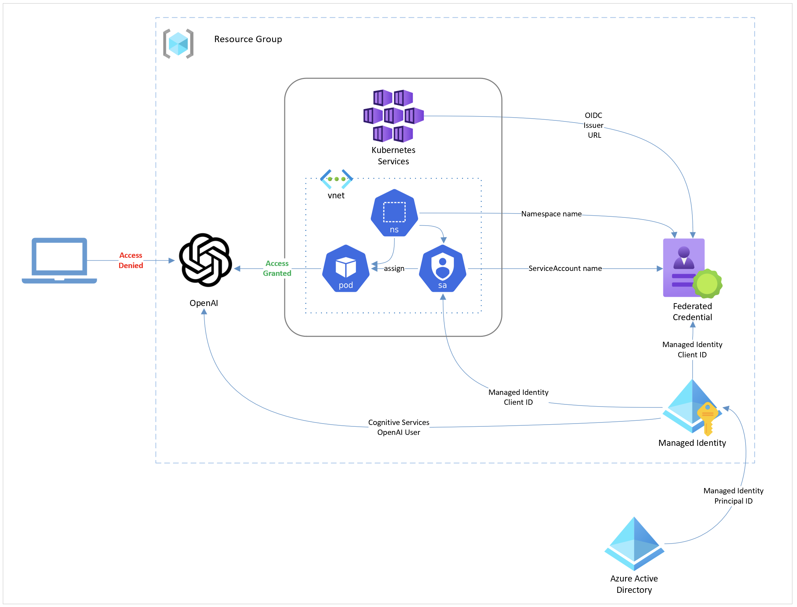

# Securing Network Access to Azure OpenAI from AKS

In this workshop, you will learn how to configure workloads hosted on AKS to securely access Azure OpenAI endpoints using Workload Identity and Azure Virtual Network service endpoints.

This workshop builds upon concepts introduced in the [Deploy an application that uses OpenAI on Azure Kubernetes Service (AKS)](https://learn.microsoft.com/azure/aks/open-ai-quickstart?tabs=aoai) and [Secure access to Azure OpenAI from Azure Kubernetes Service (AKS)](https://learn.microsoft.com/azure/aks/open-ai-secure-access-quickstart) quickstart guides.

## Objectives

The objectives of this workshop are to get you comfortable with deploying and configuring the following:

- Azure Virtual Network and subnet for AKS cluster
- Azure Kubernetes Service (AKS) cluster with Azure CNI network plugin
- Azure Managed Identity and federate with AKS cluster
- Azure OpenAI account with service endpoint enabled
- Exposing applications with Application Gateway for Containers (Preview)

## Prerequisites

- [Azure Subscription](https://azure.microsoft.com/free) with [access to Azure OpenAI](https://aka.ms/oai/access)
- [Azure CLI](https://learn.microsoft.com/cli/azure/what-is-azure-cli)
- [Visual Studio Code](https://code.visualstudio.com/)
- [Git](https://git-scm.com/)
- [kubectl](https://kubernetes.io/docs/tasks/tools/install-kubectl-linux/)
- [Helm](https://helm.sh/docs/intro/install/)
- Bash shell (e.g. [Windows Terminal](https://www.microsoft.com/p/windows-terminal/9n0dx20hk701) with [WSL](https://docs.microsoft.com/windows/wsl/install-win10) or [Azure Cloud Shell](https://shell.azure.com))
- OPTIONAL: [Python 3](https://www.python.org/downloads/)

---

## Deploy Azure Resources

Let's get the easy stuff out of the way first. We'll deploy the Azure resource group we'll be deploying resources into for this workshop.

<div class="important" data-title="Important">

> Be sure to choose an Azure region that supports both Azure OpenAI and Azure Application Gatway for Containers. You can find the list of supported regions for Azure OpenAI [here](https://azure.microsoft.com/explore/global-infrastructure/products-by-region/?products=cognitive-services&regions=all) and a list of supported regions for Azure Application Gateway for Containers [here](https://docs.microsoft.com/azure/application-gateway/for-containers/overview#supported-regions).

</div>

```sh
# Set environment variables
RAND=$RANDOM
RG_NAME="rg-secure$RAND"
AKS_NAME="aks-secure$RAND"
LOC_NAME="eastus"

# Create resource group
az group create -n $RG_NAME -l $LOC_NAME
```

### Overview of Azure deployment

Here is a diagram of the Azure resources we'll be deploying in this workshop.



### Deploy Azure virtual network

Whenever we deploy an AKS cluster, we have the option of using either Azure CNI or Kubenet networking. Azure CNI is the recommended networking option for AKS clusters. It provides better performance and more features than Kubenet.

However, Azure CNI requires that and Azure Virtual Network and subnet are created for the AKS cluster. The virtual network can be completely managed by Azure as well. But if you want more control, you will need to create and manage the virtual network yourself. That means we need to plan ahead for the IP address ranges we'll be using for the AKS cluster. Take a look at this doc to help you [plan your IP address ranges](https://learn.microsoft.com/azure/aks/configure-azure-cni-dynamic-ip-allocation#plan-ip-addressing).

We'll use a **/16** address space for the virtual network and a **/24** address space for the subnet. We'll also enable the Azure Cognitive Services [service endpoint](https://learn.microsoft.com/azure/virtual-network/virtual-network-service-endpoints-overview) for the subnet so that we can secure access to Azure OpenAI. Feel free to change the address spaces to suit your needs.

Deploy the Azure Virtual Network.

```sh
VNET_NAME=$(az network vnet create \
  -n "${AKS_NAME}-vnet" \
  -g $RG_NAME \
  --address-prefix "10.21.0.0/16" \
  --query "newVNet.name" -o tsv)
```

Next, we will carve out a subnet for the AKS cluster and enable the Azure Cognitive Services service endpoint. This service endpoint will enable secure access to Azure services like Azure OpenAI from the AKS cluster.

```sh
VNET_SUBNET_ID=$(az network vnet subnet create \
  -n "${AKS_NAME}-snet" \
  -g $RG_NAME \
  --vnet-name $VNET_NAME \
  --address-prefixes "10.21.0.0/24" \
  --service-endpoints "Microsoft.CognitiveServices" \
  --query id -o tsv)
```

<div class="info" data-title="Note">

> More on Azure Virtual Network service endpoints can be found [here](https://learn.microsoft.com/azure/virtual-network/virtual-network-service-endpoints-overview#secure-azure-services-to-virtual-networks).

</div>

### Deploy AKS cluster

For our AKS cluster, we'll need to ensure that we enable a few features. We'll need to enable Azure CNI networking and pass in the Azure virtual network ID we just created. Additionally, to support secure access to Azure resources we need to enable workload identity and the OpenID Connect (OIDC) issuer URL.

Run the following command to create the AKS cluster.

```sh
az aks create \
  -n $AKS_NAME \
  -g $RG_NAME \
  --location $LOC_NAME \
  --network-plugin azure \
  --vnet-subnet-id $VNET_SUBNET_ID \
  --enable-oidc-issuer \
  --enable-workload-identity \
  --generate-ssh-keys
```

### Deploy Azure Managed Identity and federate with AKS cluster

Authentication to Azure OpenAI from AKS is achieved using Azure Managed Identity and Workload Identity. We'll need to create an Azure Managed Identity which we'll federate with the AKS cluster.

Run the following command to create the Azure Managed Identity.

```sh
MANAGED_IDENTITY_NAME=$(az identity create \
  --resource-group $RG_NAME \
  --name "aoai-secure${RAND}-identity" \
  --query name -o tsv)
```

We need to federate the Azure Managed Identity with the AKS cluster. We'll need the OIDC issuer URL from the AKS cluster we created earlier. Run the following command to get the OIDC Issuer URL.

```sh
OIDC_ISSUER_URL=$(az aks show \
  -n $AKS_NAME \
  -g $RG_NAME \
  --query "oidcIssuerProfile.issuerUrl" -o tsv)
```

Run the following command to federate the Azure Managed Identity with the AKS cluster.

```sh
az identity federated-credential create \
  --name "${AKS_NAME}-dev-ai-sa" \
  --identity-name $MANAGED_IDENTITY_NAME \
  --resource-group $RG_NAME \
  --issuer $OIDC_ISSUER_URL \
  --subject system:serviceaccount:dev:ai-service-account
```

<div class="important" data-title="Important">

> We need to specify a value of `system:serviceaccount:dev:ai-service-account` as the subject. This is the subject that will be used on authentication requests and tells Azure AD that the authentication request is coming from our managed identity.
>
> This needs to align with the Kubernetes service account we'll be using from the application Pods.
>
> Here, we're expecting the application Pods to be deployed in the `dev` namespace and use a Kubernetes service account to be named `ai-service-account`.

</div>

### Deploy Azure OpenAI account and model

Now we can deploy the Azure OpenAI account.

```sh
AOAI_NAME=aoai-secure$RAND
AOAI_ID=$(az cognitiveservices account create \
  -n $AOAI_NAME \
  -g $RG_NAME \
  -l $LOC_NAME \
  --kind OpenAI \
  --sku S0 \
  --custom-domain $AOAI_NAME \
  --query "id" -o tsv)
```

<div class="important" data-title="Important">

> We need to specify the `--custom-domain` parameter to ensure that the Azure OpenAI account is assigned a public DNS name that Azure AD needs to authenticate using Workload Identity. Without this, Azure AD authentication will fail.

</div>

Next, grant the managed identity access to the Azure OpenAI resource.

```sh
az role assignment create \
  --assignee $(az identity show \
  --resource-group $RG_NAME \
  --name $MANAGED_IDENTITY_NAME \
  --query principalId -o tsv) \
  --role "Cognitive Services OpenAI User" \
  --scope $AOAI_ID
```

While you're at it, grant yourself access to the Azure OpenAI resource too. We'll need this for testing later.

```sh
az role assignment create \
  --assignee $(az account show --query user.name -o tsv)\
  --role "Cognitive Services OpenAI User" \
  --scope $AOAI_ID
```

Finally, deploy a **gpt-35-turbo** model.

```sh
az cognitiveservices account deployment create \
  --name $AOAI_NAME \
  --resource-group $RG_NAME \
  --deployment-name gpt-35-turbo \
  --model-format OpenAI \
  --model-name gpt-35-turbo \
  --model-version "0613" \
  --sku Standard \
  --capacity 120
```

<div class="important" data-title="Important">

> Model versions vary based on the location. You can find the latest model version for your location by running the following command.
>
> `az cognitiveservices account list-models -g $RG_NAME -n $AOAI_NAME -o table`

</div>

### Configure Azure OpenAI network security

By default, Azure OpenAI is accessible from the public internet. We need to restrict access to Azure OpenAI to only the AKS cluster we created earlier.

If you run the following command, you will see that the `networkAcls` is not set which allow access from all networks.

```sh
az cognitiveservices account show \
  -g $RG_NAME \
  -n $AOAI_NAME \
  --query properties | grep networkAcls
```

Let's close this off by restricting access to only the AKS cluster we created earlier. We do this by adding a network rule to allow access from the AKS cluster's subnet.

```sh
az cognitiveservices account network-rule add \
  -g $RG_NAME \
  -n $AOAI_NAME \
  --subnet $VNET_SUBNET_ID
```

Now if we run the following command, we should see that the default action is to deny access from all networks but **virtualNetworkRules** are enabled to allow traffic from our AKS cluster's subnet.

```sh
az cognitiveservices account show \
    -g $RG_NAME \
    -n $AOAI_NAME \
    --query properties.networkAcls
```

That's all we need to enable network security for Azure OpenAI. Let's test it to make sure it works.

---

## Test Azure OpenAI network security

We'll test our access to Azure OpenAI in two ways. First, we'll access it from our machine by running the **ai-service** locally. Then we'll deploy the app to AKS and test it from there.

### Test the app locally

<div class="info" data-title="Info">

> If you do not have Python 3 installed, you can skip this section and move on to the [Deploy the sample application to AKS](/workshop/?src=gh%3Apauldotyu%2Fmoaw%2Fsecure-aoai-aks-part-2%2Fworkshops%2Fsecure-aoai-aks-network%2F&step=2#deploy-the-sample-application-to-aks) section below.

</div>

We'll need to get the source code for the **ai-service** app. We'll use the **git** command to clone the repo and "drop" into the **ai-service** directory.

```sh
git clone https://github.com/Azure-Samples/aks-store-demo.git
cd aks-store-demo/src/ai-service
```

Next, we'll need to install the Python dependencies for the app. We'll use the **pip** command to install the dependencies into a virtual environment.

```sh
python3 -m venv .venv
source .venv/bin/activate
pip install -r requirements.txt
```

We can use our Azure CLI credentials to authenticate to Azure OpenAI bu twe need a few more environment variables to configure the app.

```sh
export USE_AZURE_OPENAI=True
export USE_AZURE_AD=True
export AZURE_OPENAI_DEPLOYMENT_NAME=gpt-35-turbo
export AZURE_OPENAI_ENDPOINT=https://${AOAI_NAME}.openai.azure.com/
```

Now we can run the app.

```sh
uvicorn main:app --host 127.0.0.1 --port 5001
```

Open a new terminal and run the following commands to test the app.

```sh
curl --request POST \
  --url http://localhost:5001/generate/description \
  --header 'content-type: application/json' \
  --data '{"name": "Seafarer'\''s Tug Rope","tags": ["toy","dog"]}'
```

Since the request is coming from our machine, we should get the following response back from Azure OpenAI.

```text
Error: (<ErrorCodes.ServiceError: 6>, 'OpenAI service failed to complete the chat', PermissionError(message='Access denied due to Virtual Network/Firewall rules.', http_status=403, request_id=None))%  
```

Great! We've successfully secured access to Azure OpenAI from our machine. Now let's test it from AKS.

If you haven't done so already stop the **ai-service** and exit the Python virtual environment.

```sh
# if needed, stop the app with Ctrl+C

# exit the virtual environment
deactivate

# get back to previous directory
cd -
```

### Deploy the sample application to AKS

Let's use a Helm Chart to deploy the AKS Store Demo application. But before we do, we'll need to set a few environment variables. We'll need the managed identity client id and the Azure OpenAI endpoint.

```sh
# Get the managed identity client id
MANAGED_IDENTITY_CLIENT_ID=$(az identity show \
  --resource-group $RG_NAME \
  --name $MANAGED_IDENTITY_NAME \
  --query clientId -o tsv)

# Get the aoai endpoint
AOAI_ENDPOINT=$(az cognitiveservices account show \
  --resource-group $RG_NAME \
  --name $AOAI_NAME \
  --query properties.endpoint -o tsv)
```

Run the following command to connect to the AKS cluster.

```sh
az aks get-credentials -n $AKS_NAME -g $RG_NAME
```

Now we can install the Helm chart to deploy the [AKS Store Demo app](https://github.com/azure-samples/aks-store-demo).

```sh
helm install aks-store-demo oci://ghcr.io/pauldotyu/aks-store-demo-chart \
  --version 1.0.0 \
  --namespace dev \
  --create-namespace \
  --set aiService.create=true \
  --set aiService.modelDeploymentName=gpt-35-turbo \
  --set aiService.openAiEndpoint=$AOAI_ENDPOINT \
  --set aiService.managedIdentityClientId=$MANAGED_IDENTITY_CLIENT_ID
```

### Test the application from AKS

Wait for all the Pods to be in a **Running** state, then run the following command to port-forward the **store-admin** service.

```sh
kubectl get pods -n dev -w
```

Once you confirmed all the pods are running, press **Ctrl+C** to exit the `kubectl get pods` command then run the following command to port-forward the **store-admin** service.

```sh
kubectl port-forward svc/store-admin -n dev 8081:80
```

Keep the port-forward running and open a browser and navigate to http://localhost:8081.

Click on the **Products** link in the top navigation bar. You should see a list of products. Click on the **Add Product** button to add a new product.

Fill in the form with a product name, a price, and some keywords and click the **Ask OpenAI** button. You should see a product description generated by OpenAI.

Congratulations! You've successfully secured access to Azure OpenAI from AKS from both an identity and network perspective.

---

## Exposing applications with Application Gateway for Containers

Now that we have a working application, we should allow users to be able to access the site over the public internet. In the previous section, we used port-forwarding to access the application. But that's just for testing locally. We need to use a more robust solution.

One option we have is to use the new [Azure Application Gateway for Containers](https://learn.microsoft.com/azure/application-gateway/for-containers/overview) service which is Azure's latest Layer 7 load balancing solution for Containers on AKS.

This service is the evolution of the [Application Gateway Ingress Controller for Kubernetes](https://learn.microsoft.com/azure/application-gateway/ingress-controller-overview) and provides several benefits over the previous solution including performance and the ability to use [Gateway API](https://gateway-api.sigs.k8s.io/) to configure the Application Gateway.

<div class="info" data-title="Note">

> At the time of this writing, Azure Application Gateway for Containers is currently in Preview and only available in [select regions](https://learn.microsoft.com/azure/application-gateway/for-containers/overview#supported-regions)

</div>

To make this work, we need to deploy a few more Azure resources. Here's a high-level overview of what we'll be deploying.

1. Azure Managed Identity for the Application Load Balancer (ALB) Controller
1. Role assignments to delegate permissions to the Application Load Balancer Controller
1. Application Load Balancer subnet and delegation which will be used by the Application Load Balancer Controller
1. Application Load Balancer
1. Gateway resource to configure the Application Gateway
1. HTTPRoute resource to configure the Application Gateway routing

The ALB controller supports the [Gateway API](https://gateway-api.sigs.k8s.io/) which is a Kubernetes API that allows you to configure Application Gateway resources. It is an evolution of the [Ingress API](https://kubernetes.io/docs/concepts/services-networking/ingress/#the-ingress-resource) and provides a more declarative way to configure Application Gateway resources.

Here is a high-level diagram from the [Gateway API docs](https://gateway-api.sigs.k8s.io/) that illustrates how the resources fit together and the various roles it serves.


Before you begin, make sure you have all the right features enabled on your subscription. Run the following command to check.

```sh
az provider register --namespace Microsoft.Network
az provider register --namespace Microsoft.NetworkFunction
az provider register --namespace Microsoft.ServiceNetworking

az extension add --name alb
```

### Install ALB controller

The Application Load Balancer (ALB) Controller is a Kubernetes controller that manages Azure Application Gateway for Containers resource. We'll need to create an Azure Managed Identity and delegate permissions to the AKS Managed Cluster resource group.

```sh
ALB_IDENTITY_NAME="alb-secure${RAND}-identity"
ALB_PRINCIPAL_ID=$(az identity create \
  --resource-group $RG_NAME \
  --name $ALB_IDENTITY_NAME \
  --query principalId -o tsv)
```

Just like we did previously when we secured access to our Azure OpenAI instance, we need to leverage AKS Workload Identity again and federate the ALB identity with the AKS cluster. The ALB controller uses a Kubernetes service account named **alb-controller-sa** in the **azure-alb-system** namespace so we'll need to specify that as the subject.

```sh
az identity federated-credential create \
  --name "alb-controller-sa" \
  --identity-name $ALB_IDENTITY_NAME \
  --resource-group $RG_NAME \
  --issuer "$OIDC_ISSUER_URL" \
  --subject "system:serviceaccount:azure-alb-system:alb-controller-sa"
```

The ALB identity will also need **Reader** permissions on the AKS Managed Cluster resource group.

```sh
# Get the AKS Managed Cluster resource group name
MC_RG_NAME=$(az aks show \
  --resource-group $RG_NAME \
  --name $AKS_NAME \
  --query "nodeResourceGroup" \
  -o tsv)

# Get the AKS Managed Cluster resource group id
MC_RG_ID=$(az group show \
  --name $MC_RG_NAME \
  --query id \
  -o tsv)

# Apply Reader role to the AKS managed cluster resource group for the newly provisioned identity
az role assignment create \
  --assignee-object-id $ALB_PRINCIPAL_ID \
  --assignee-principal-type ServicePrincipal \
  --scope $MC_RG_ID \
  --role "Reader"
```

Now we can install the ALB controller using Helm.  This will install the ALB controller in the **azure-alb-system** namespace but you can override this if needed.

```sh
ALB_CLIENT_ID=$(az identity show \
  --resource-group $RG_NAME \
  --name $ALB_IDENTITY_NAME \
  --query clientId -o tsv)

helm install alb-controller oci://mcr.microsoft.com/application-lb/charts/alb-controller \
  --version 0.5.024542 \
  --set albController.podIdentity.clientID=$ALB_CLIENT_ID
```

<div class="info" data-title="Note">

> For more information on the ALB controller and its latest releases, see the [release notes](https://learn.microsoft.com/azure/application-gateway/for-containers/alb-controller-release-notes).

</div>

### ALB network configuration

The ALB controller needs to be able to create and manage Application Gateway resources within a dedicated subnet. We'll need to create a subnet and delegate it to **Microsoft.ServiceNetworking/trafficControllers** so that the ALB controller can create and manage Application Gateway resources.

```sh
# Create ALB subnet IP range taking the next available /24 subnet from the AKS VNet
ALB_SUBNET_ADDRESS_PREFIX='10.21.1.0/24'
ALB_SUBNET_NAME='alb-controller-snet'

# Create ALB subnet and delegate the Microsoft.ServiceNetworking/trafficControllers role
ALB_SUBNET_ID=$(az network vnet subnet create \
  --resource-group $RG_NAME \
  --vnet-name $VNET_NAME \
  --name $ALB_SUBNET_NAME \
  --address-prefixes $ALB_SUBNET_ADDRESS_PREFIX \
  --delegations 'Microsoft.ServiceNetworking/trafficControllers' \
  --query '[id]' \
  --output tsv)

# Grant the ALB identity the "AppGw for Containers Configuration Manager" role on the AKS managed cluster resource group
az role assignment create \
  --assignee-object-id $ALB_PRINCIPAL_ID \
  --assignee-principal-type ServicePrincipal \
  --scope $MC_RG_ID \
  --role "AppGw for Containers Configuration Manager"

# Grant the ALB identity the "Network Contributor" role to join devices to the subnet
az role assignment create \
  --assignee-object-id $ALB_PRINCIPAL_ID \
  --assignee-principal-type ServicePrincipal \
  --scope $ALB_SUBNET_ID \
  --role "Network Contributor"
```

<div class="info" data-title="Note">

> More on subnet delegation can be found [here](https://learn.microsoft.com/azure/application-gateway/for-containers/application-gateway-for-containers-components#subnet-delegation).

</div>

### Create a ALB resource

Now we can deploy the **ApplicationLoadBalancer** resource. When the ALB resource is deployed, it will need to know which subnet to associate it with.

```sh
kubectl apply -f - <<EOF
apiVersion: alb.networking.azure.io/v1
kind: ApplicationLoadBalancer
metadata:
  name: aks-store-demo-alb
  namespace: azure-alb-system
spec:
  associations:
  - $ALB_SUBNET_ID
EOF
```

### Create a Gateway resource

The ALB control supports both Gateway and Ingress APIs, but Gateway API is the future when working with gateway resources, and so we'll use it to configure the our application gateway.

Using Gateway API, create a **Gateway** in the designated subnet.

```sh
kubectl apply -f - <<EOF
apiVersion: gateway.networking.k8s.io/v1beta1
kind: Gateway
metadata:
  name: aks-store-demo-gateway
  namespace: dev
  annotations:
    alb.networking.azure.io/alb-name: aks-store-demo-alb      # This annotation is required to associate the Gateway with the ALB controller
    alb.networking.azure.io/alb-namespace: azure-alb-system   # This annotations is required to associate the Gateway with the ALB controller
spec:
  gatewayClassName: azure-alb-external
  listeners:
  - name: http-listener
    port: 80
    protocol: HTTP
    allowedRoutes:
      namespaces:
        from: Same
EOF
```

<div class="info" data-title="Note">

> The step above will take a few minutes to complete.

</div>

You can check the status of the Application Gateway by running the following command.

```sh
kubectl get gateway aks-store-demo-gateway -n dev -o yaml -w
```

Once you see the message **_Application Gateway for Containers resource has been successfully updated._**, you can proceed to the next step.

### Create a HTTPRoute resource

Using Gateway API again, let's now create a **HTTPRoute** resource to route incoming traffic to our store-admin service.

We need to specify the **Gateway** resource we created earlier as the parent resource. We also need to specify the hostname that we want to use to access our application. As part of the Gateway provisioning process a **FQDN** has been generated for us.

Run the following command to get the dynamically generated host name.

```sh
FQDN=$(kubectl get gateway aks-store-demo-gateway -n dev -o jsonpath='{.status.addresses[0].value}')
```

<div class="info" data-title="Note">

> We'll just stick with the dynamic **FQDN** to create the **HTTPRoute** resource. But if you want to use a custom hostname, you can do so by adding a CNAME record to your DNS zone, pointing it to the **FQDN**, and add your custom hostname to the **hostnames** property.

</div>

```sh
kubectl apply -f - <<EOF
apiVersion: gateway.networking.k8s.io/v1beta1
kind: HTTPRoute
metadata:
  name: store-admin-route
  namespace: dev
spec:
  parentRefs:
  - name: aks-store-demo-gateway
  hostnames:
  - "${FQDN}"
  rules:
  - backendRefs:
    - name: store-admin
      port: 80
EOF
```

With everything in place, we can run the following command to get the URL of the application.

```sh
echo "http://${FQDN}/"
```

Open a browser and navigate to the **FQDN**. You should see the application and you should be able to add a product and generate a description using Azure OpenAI again!

We only scratched the surface of what you can do with the Application Gateway for Containers. You can implement functionality like SSL termination, backend mTLS, path-based, header, and query-string based routing, traffic splitting, and more. So be sure to check out the [documentation](https://docs.microsoft.com/azure/application-gateway/for-containers/overview) to learn more.

---

## Summary

In this workshop, you learned how to configure workloads hosted on AKS to securely access Azure OpenAI endpoints using Workload Identity. Security in depth is a key principle in securing applications and services especially in the cloud. Just having network security or just identity security is not enough. You need both to ensure that your applications and services are secure.

Hopefully you found this workshop useful. If you have any questions or feedback, please feel free to reach out to me on Twitter [@pauldotyu](https://twitter.com/pauldotyu) or LinkedIn [/in/yupaul](https://www.linkedin.com/in/yupaul/).

You can even slide into the [Microsoft Open Source Discord](https://aka.ms/cloudnative/JoinOSSDiscord) and message my team in the [Cloud Native Channel](https://aka.ms/cloudnative/DiscordChannel).

### Additional Resources

- [Learn Live: Intelligent Apps with Azure Kubernetes Service](https://aka.ms/learnlive-intelligent-apps-with-azure-kubernetes-service)
- [Full end-to-end deployment of this lab using Terraform](https://aka.ms/cloudnative/learnlive-intelligent-apps-on-aks-e2e)
- [Deploy an application that uses OpenAI on Azure Kubernetes Service (AKS)](https://learn.microsoft.com/azure/aks/open-ai-quickstart?tabs=aoai)
- [Secure access to Azure OpenAI from Azure Kubernetes Service (AKS)](https://learn.microsoft.com/azure/aks/open-ai-secure-access-quickstart)
- [Use Azure AD workload identity with Azure Kubernetes Service (AKS)](https://learn.microsoft.com/azure/aks/workload-identity-overview)
- [How to configure Azure OpenAI Service with managed identities](https://learn.microsoft.com/azure/ai-services/openai/how-to/managed-identity)
- [Configure Azure AI services virtual networks](https://learn.microsoft.com/azure/ai-services/cognitive-services-virtual-networks?tabs=portal)
- [What is Application Gateway for Containers? (preview)](https://learn.microsoft.com/azure/application-gateway/for-containers/overview)
