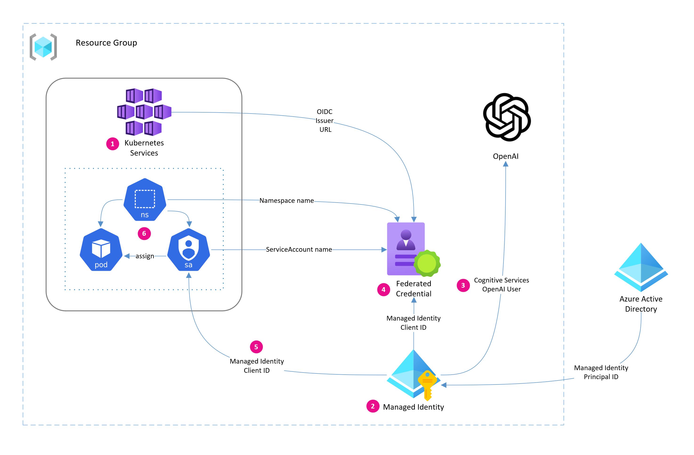

## Getting Started

In this workshop, you will learn how to configure workloads hosted on AKS to securely access Azure OpenAI endpoints using Azure AD Workload Identity.

### Objectives

The objectives of this workshop are to:

- Introduce you to the basics Azure AD workload identity
- Learn how to configure Azure AD workload identity for AKS including:
  - Enabling Workload Identity on AKS
  - Creating an Azure User-Assigned Managed Identity
  - Creating an Azure AD Federated Credential
  - Enabling Workload Identity on a Kubernetes Pod via ServiceAccount

We'll also use Azure Identity SDK for Python to authenticate to Azure OpenAI via SemanticKernel SDK.

### Prerequisites

In order to complete this workshop, you will need to first complete all the steps in the [Deploy an application that uses OpenAI on Azure Kubernetes Service (AKS)](https://aka.ms/aks-openai) quickstart guide.

Let's illustrate what we want to fix. 

<div class="task" data-title="task">

> Run the following command in a terminal.

</div>

```bash
kubectl describe pod --selector app=ai-service
```

Under `Environment`, you will notice that the `OPENAI_API_KEY` is available in plain text. This is not ideal as it can be easily compromised if the wrong person gets access to the pod.

---

## Preparing the application

Application code changes will be required to allow the `ai-service` to use either Azure AD or OpenAI API key to authenticate against Azure OpenAI Service. But we'll see that the changes will be minimal.

<div class="task" data-title="task">

> Navigate to the https://github.com/Azure-Samples/aks-store-demo.git repo and open it using [GitHub Codespaces](https://github.com/features/codespaces). 

</div>

<div class="info" data-title="info">

> Optionally you can clone the repo to your local machine, but you will need to ensure you have [Python3.8 or higher](https://www.python.org/downloads/), [Azure CLI](https://learn.microsoft.com/cli/azure/install-azure-cli), and [`kubectl`](https://kubernetes.io/docs/tasks/tools/install-kubectl-linux/) installed.

</div>

With the repo open in a terminal, make sure to checkout a specific commit.

<div class="task" data-title="task">

> Run the following command to checkout a commit.

</div>

```bash
git checkout e858d8bfd92b142dbb9e8b3b890a5f191e8fc926
```

### Overview of Azure Identity SDK

[Azure Identity SDK](https://learn.microsoft.com/python/api/overview/azure/identity-readme?view=azure-python) is a token acquisition library that is built on top of [Microsoft Authentication Library (MSAL)](https://learn.microsoft.com/azure/active-directory/develop/msal-overview). It is integrated with all the Azure SDK client libraries and offers a good abstraction layer to help you obtain security tokens without needing to know all the complexities different credential types (e.g., default, environment, managed identity, interactive, etc.). 

This makes using token-based authentication easy for accessing services across Azure that are supported by Azure SDK client libraries.

### Role assignment

As we make changes to the app, we want to be able to test it locally before deploying it to AKS. To do that, we'll need to ensure our Azure account has access to the Azure OpenAI resource.

<div class="task" data-title="task">

> In VSCode, open a terminal and login to Azure.

</div>

```bash
az login
```

<div class="task" data-title="task">

> Add yourself as a **Cognitive Services OpenAI User** on the Azure OpenAI resource. This role is the minimum required to access the Azure OpenAI API endpoints.

</div>

```bash
# Get the Azure OpenAI resource group name
RG_NAME=myResourceGroup

# Get the Azure OpenAI resource id
AOAI_RESOURCE_ID=$(az resource list \
  --resource-group $RG_NAME \
  --resource-type Microsoft.CognitiveServices/accounts \
  --query "[0].id" -o tsv)

# Add yourself as a Cognitive Services OpenAI User
az role assignment create \
  --role "Cognitive Services OpenAI User" \
  --assignee $(az account show --query user.name -o tsv) \
  --scope $AOAI_RESOURCE_ID
```

<div class="warning" data-title="warning">

> This can take up to 5 minutes to propagate, so let's move on to the next section.

</div>

### Update the application code

With the code open in VSCode, navigate to the `src/ai-service` directory and open the `requirements.txt` file.
 
<div class="task" data-title="task">

> Add the `azure.identity==1.14.0` package to the end of the file.

</div>

It should look like this:

<details>

<summary>requirements.txt</summary>

```txt
fastapi==0.95.2
uvicorn==0.22.0
pydantic==1.10.8
pytest==7.3.1
httpx
pyyaml
semantic-kernel==0.3.1.dev0
azure.identity==1.14.0
```

</details>

Next, open the `src/ai-service/routers/description_generator.py` file 

<div class="task" data-title="task">

> Add the following import statement to the top of the file at line 1.

</div>

```python
from azure.identity import DefaultAzureCredential
```

The app uses the [Semantic Kernel](https://learn.microsoft.com/semantic-kernel/overview/) and expects certain environment variables to be set in order to determine which OpenAI endpoint to use. 

If `USE_AZURE_OPENAI` is set to **True**, then the app will use the Azure OpenAI Service. If this is set to false, it will use OpenAI directly.

When `USE_AZURE_OPENAI` is set to **True**, we want users to have the option to use authenticate using Azure AD in addition to the `OPENAI_API_KEY`.

We'll do this by looking for a new environment variable called `USE_AZURE_AD` that will be either **True** or **False**.

<div class="task" data-title="task">

> On line 22, add the following code to get the `USE_AZURE_AD` environment variable.

</div>

```python
useAzureAD: str = os.environ.get("USE_AZURE_AD")
```

<div class="task" data-title="task">

> On line 24 (immediately after what you just added), replace the condition with the following code to enforce the existence of the `OPENAI_API_KEY` if `USE_AZURE_AD` is set to **False** or not set at all.

</div>

```python
if (isinstance(api_key, str) == False or api_key == "") and (isinstance(useAzureAD, str) == False or useAzureAD == ""):
```

<div class="task" data-title="task">

> On line 42, replace the `kernel.add_chat_service` function call with the following to use Azure Identity SDK when `USE_AZURE_AD` is set to **True**.

</div>

```python
if isinstance(useAzureAD, str) == True and useAzureAD.lower() == "true":
    print("Authenticating to Azure OpenAI with Azure AD Workload Identity")
    credential = DefaultAzureCredential()
    access_token = credential.get_token("https://cognitiveservices.azure.com/.default")
    kernel.add_chat_service("dv", AzureChatCompletion(deployment_name=deployment, endpoint=endpoint, api_key=access_token.token, ad_auth=True))
else:
    print("Authenticating to Azure OpenAI with OpenAI API key")
    kernel.add_chat_service("dv", AzureChatCompletion(deployment, endpoint, api_key))
```

Most of what we coded was to support the new `USE_AZURE_AD` environment variable. The only change we made to the existing code was in the `AzureChatCompletion` constructor. 

We get the credential from Azure Identity SDK by calling the `DefaultAzureCredential()` function (which will attempt to use the `WorkloadIdentityCredential`) then get the token for the scope `https://cognitiveservices.azure.com/.default` which is what Azure OpenAI uses. From there, we pass the bearer token as the `api_key` and SemanticKernel will know to use Azure AD for authentication because we are setting `ad_auth` to **True**.  

Here's the full code for `description_generator.py`:

<details>

<summary>description_generator.py</summary>

```python
from azure.identity import DefaultAzureCredential
from fastapi import APIRouter, Request, status
from fastapi.responses import Response, JSONResponse
import semantic_kernel as sk
from semantic_kernel.connectors.ai.open_ai import AzureChatCompletion, OpenAIChatCompletion
from dotenv import load_dotenv
from typing import Any, List, Dict
import os
import dotenv

# Load environment variables from .env file
load_dotenv()

# Initialize the semantic kernel
kernel: sk.Kernel = sk.Kernel()

kernel = sk.Kernel()

# Get the Azure OpenAI deployment name, API key, and endpoint or OpenAI org id from environment variables
useAzureOpenAI: str = os.environ.get("USE_AZURE_OPENAI")
api_key: str = os.environ.get("OPENAI_API_KEY")
useAzureAD: str = os.environ.get("USE_AZURE_AD")

if (isinstance(api_key, str) == False or api_key == "") and (isinstance(useAzureAD, str) == False or useAzureAD == ""):
    raise Exception("OPENAI_API_KEY environment variable must be set")
if isinstance(useAzureOpenAI, str) == False or (useAzureOpenAI.lower() != "true" and useAzureOpenAI.lower() != "false"):
    raise Exception("USE_AZURE_OPENAI environment variable must be set to 'True' or 'False' string not boolean")

if useAzureOpenAI.lower() == "false":
    org_id = os.environ.get("OPENAI_ORG_ID")
    if isinstance(org_id, str) == False or org_id == "":
        raise Exception("OPENAI_ORG_ID environment variable must be set when USE_AZURE_OPENAI is set to False")
    # Add the OpenAI text completion service to the kernel
    kernel.add_chat_service("dv", OpenAIChatCompletion("gpt-3.5-turbo", api_key, org_id))

else:
    deployment: str = os.environ.get("AZURE_OPENAI_DEPLOYMENT_NAME")
    endpoint: str = os.environ.get("AZURE_OPENAI_ENDPOINT")
    if isinstance(deployment, str) == False or isinstance(endpoint, str) == False or deployment == "" or endpoint == "":
        raise Exception("AZURE_OPENAI_DEPLOYMENT_NAME and AZURE_OPENAI_ENDPOINT environment variables must be set when USE_AZURE_OPENAI is set to true")
    # Add the Azure OpenAI text completion service to the kernel
    if isinstance(useAzureAD, str) == True and useAzureAD.lower() == "true":
        print("Authenticating to Azure OpenAI with Azure AD Workload Identity")
        credential = DefaultAzureCredential()
        access_token = credential.get_token("https://cognitiveservices.azure.com/.default")
        kernel.add_chat_service("dv", AzureChatCompletion(deployment_name=deployment, endpoint=endpoint, api_key=access_token.token, ad_auth=True))
    else:
        print("Authenticating to Azure OpenAI with OpenAI API key")
        kernel.add_chat_service("dv", AzureChatCompletion(deployment, endpoint, api_key))

# Import semantic skills from the "skills" directory
skills_directory: str = "skills"
productFunctions: dict = kernel.import_semantic_skill_from_directory(skills_directory, "ProductSkill")
descriptionFunction: Any = productFunctions["Description"]

# Define the description API router
description: APIRouter = APIRouter(prefix="/generate", tags=["generate"])

# Define the Product class
class Product:
    def __init__(self, product: Dict[str, List]) -> None:
        self.name: str = product["name"]
        self.tags: List[str] = product["tags"]
 
# Define the post_description endpoint
@description.post("/description", summary="Get description for a product", operation_id="getDescription")
async def post_description(request: Request) -> JSONResponse:
    try:
        # Parse the request body and create a Product object
        body: dict = await request.json()
        product: Product = Product(body)
        name: str = product.name
        tags: List = ",".join(product.tags)

        # Create a new context and invoke the description function
        context: Any = kernel.create_new_context()
        context["name"] = name
        context["tags"] = tags
        result: str = await descriptionFunction.invoke_async(context=context)
        if "error" in str(result).lower():
            return Response(content=str(result), status_code=status.HTTP_401_UNAUTHORIZED)
        print(result)
        result = str(result).replace("\n", "")

        # Return the description as a JSON response
        return JSONResponse(content={"description": result}, status_code=status.HTTP_200_OK)
    except Exception as e:
        # Return an error message as a JSON response
        return JSONResponse(content={"error": str(e)}, status_code=status.HTTP_400_BAD_REQUEST)
```

</details>

### Test the app locally

Let's test the app locally to ensure it works before we deploy it to AKS.

<div class="task" data-title="task">

> Open a terminal and navigate to the `src/ai-service` directory.

</div>

```bash
cd src/ai-service
```

<div class="task" data-title="task">

> Create a virtual environment and install the dependencies.

</div>

```bash
python3 -m venv .venv
source .venv/bin/activate
pip install -r requirements.txt
```

<div class="task" data-title="task">

> If necessary, login to Azure.

</div>

```bash
az login
```

<div class="task" data-title="task">

> Get the Azure OpenAI details and set the environment variables.

</div>

```bash
# Get the Azure OpenAI resource group name
RG_NAME=myResourceGroup

# Get the Azure OpenAI resource name
AOAI_NAME=$(az resource list \
  --resource-group $RG_NAME \
  --resource-type Microsoft.CognitiveServices/accounts \
  --query "[0].name" -o tsv)

# Get the Azure OpenAI endpoint
AOAI_ENDPOINT=$(az cognitiveservices account show \
  --resource-group $RG_NAME \
  --name $AOAI_NAME \
  --query properties.endpoint -o tsv)

# Get the Azure OpenAI deployment name
AOAI_DEPLOYMENT_NAME=$(az cognitiveservices account deployment list  \
  --resource-group $RG_NAME \
  --name $AOAI_NAME \
  --query "[0].name" -o tsv)

# Set the environment variables
export USE_AZURE_OPENAI=True
export USE_AZURE_AD=True
export AZURE_OPENAI_ENDPOINT=$AOAI_ENDPOINT
export AZURE_OPENAI_DEPLOYMENT_NAME=$AOAI_DEPLOYMENT_NAME

# Verify the environment variables
printenv | grep AZURE
```

<div class="task" data-title="task">

> Run the app.

</div>

```bash
uvicorn main:app --host 127.0.0.1 --port 5001
```

<div class="task" data-title="task">

> With the application running, open a new terminal and run the following command to test the app.

</div>

```bash
curl -X POST "http://localhost:5001/generate/description" -H "accept: application/json" -H "Content-Type: application/json" -d "{\"name\":\"Seafarer's Tug Rope\",\"tags\":[\"toy\",\"dog\"]}"
```

You should get a response similar to the following:

<details>

<summary>JSON</summary>

```json
{"description":"Engage your dog in a game of tug-of-war with the Seafarer's Tug Rope. This durable toy is perfect for interactive play and helps keep your pup entertained and active."}
```

</details>

<div class="task" data-title="task">

> Stop the app by pressing `Ctrl+C` in the terminal then typing `deactivate` to exit the virtual environment.

</div>

<div class="info" data-title="info">

> The app used the Azure Identity SDK to authenticate to Azure OpenAI and since you are logged in to Azure it was able to use your credentials to authenticate to Azure OpenAI.

</div>

### Build and push container

We are ready to perform the next steps of configuring Azure AD Workload Identity on AKS. Before we do, we need to build and push the container image to a container registry.

The quickstart tutorial does not include a container registry, so we will use `ttl.sh` to host our container image.

[ttl.sh](https://ttl.sh) is great for quick container testing and demos. It’s a free ephemeral container registry service that allows you to push a container to a registry which will expire after a period of time. This period of time is configured using image tags (e.g., `1h` for 1 hour and `1m` for 1 minute). 

In a real world scenario, you would use a persistent container registry like [Azure Container Registry](https://azure.microsoft.com/services/container-registry/) or [Docker Hub](https://hub.docker.com/).

<div class="important" data-title="important">

> You will need to have [Docker](https://docs.docker.com/get-docker/) installed to build and push the container image.

</div>

<div class="task" data-title="task">

> Run the following commands to build and push the container image to `ttl.sh`. This image will live for 1 hour.

</div>

```bash
# Generate a UUID for randomness
UUID=$(uuidgen | tr '[:upper:]' '[:lower:]')

# Set the image name
IMAGE_NAME=$(echo ttl.sh/$UUID:1h)

# Build the image
docker build --platform=linux/amd64 -t $IMAGE_NAME .

# Push the image
docker push $IMAGE_NAME
```

<div class="task" data-title="task">

> Verify the image was pushed to `ttl.sh`.

</div>

```bash
docker pull $IMAGE_NAME
```

<div class="info" data-title="info">

> We are now "on the clock" to deploy the container image to AKS. If we don't do it within the next hour, the image will be deleted from `ttl.sh`.

</div>

---

## Enabling Azure AD Workload Identity

Azure AD Workload Identity is a capability that allows an Azure identity to be assigned to an application workload which can then be used to authenticate and access services and resources protected by Azure AD.

At a high-level, Azure AD federates with a Kubernetes cluster to establish trust, and Workload Identity uses [OpenID Connect](https://openid.net/connect/) (OIDC) to authenticate with Azure AD.

The Kubernetes cluster needs to be configured to use [ServiceAccount token volume projection](https://kubernetes.io/docs/tasks/configure-pod-container/configure-service-account/#serviceaccount-token-volume-projection) which will place a ServiceAccount token into a Pod. This token is sent to Azure AD where it is validated for authenticity and exchanged for an Azure AD bearer token. From there, the Pod uses the Azure AD token to access Azure resources.

How does Azure AD know how and where to validate this token, you ask? It validates the token against the OIDC endpoint that you tell it to when establishing the trust between Azure AD and your Kubernetes cluster.

The token exchange is handled within your app using the Azure Identity SDK or the Microsoft Authentication Library (MSAL), which we've already done in the previous section.

The diagram depicted [here](https://azure.github.io/azure-workload-identity/docs/concepts.html) gives a good visual representation of the token exchange process.

### Configuration overview

Here is a high level overview of the steps we will be performing in this section:

1. Enable Workload Identity and OIDC issuer endpoint on AKS cluster
1. Create a user-assigned managed identity
1. Grant role permission to managed identity
1. Create federated credential
1. Create Kubernetes ServiceAccount
1. Update `ai-service` Pod to use ServiceAccount

This diagram illustrates the configuration process.



### Enable workload identity on AKS

The Azure AD Workload Identity and OIDC Issuer Endpoint features are not enabled by default on AKS. But, we can enable them on our existing AKS cluster using the Azure CLI.

<div class="task" data-title="task">

> Run the following commands to enable Azure AD Workload Identity and OIDC Issuer Endpoint on AKS.

</div>

```bash
# Set the resource group name
RG_NAME=myResourceGroup

# Get the AKS resource group name
AKS_NAME=$(az resource list \
  --resource-group $RG_NAME \
  --resource-type Microsoft.ContainerService/ManagedClusters \
  --query "[0].name" -o tsv)

# Enable Azure AD Workload Identity and OIDC Issuer Endpoint on AKS
az aks update \
  --resource-group $RG_NAME \
  --name $AKS_NAME \
  --enable-oidc-issuer \
  --enable-workload-identity
```

Once the command completes, we will need the OIDC issuer URL for when we create the Azure AD Federated Credential.

<div class="task" data-title="task">

> Run the following command to get the OIDC issuer URL. We'll need this value later.

</div>

```bash
# Get the AKS OIDC Issuer Endpoint
AKS_OIDC_ISSUER=$(az aks show \
  --name $AKS_NAME \
  --resource-group $RG_NAME \
  --query "oidcIssuerProfile.issuerUrl" -o tsv)
```

### Create an Azure Managed Identity

Next, we create a User-Assigned Managed Identity that will be used to authenticate to Azure OpenAI endpoints.

<div class="task" data-title="task">

> Run the following commands to create an Azure User-Assigned Managed Identity and retrieve the client id and object id as they will also be needed later.

</div>

```bash
# Set the managed identity name
MANAGED_IDENTITY_NAME=myIdentity

# Create the managed identity and return the client id
MANAGED_IDENTITY_CLIENT_ID=$(az identity create \
  --resource-group $RG_NAME \
  --name $MANAGED_IDENTITY_NAME \
  --query clientId -o tsv)

# Get the managed identity object id
MANAGED_IDENTITY_OBJECT_ID=$(az identity show \
  --resource-group $RG_NAME \
  --name $MANAGED_IDENTITY_NAME \
  --query principalId -o tsv)
```

<div class="task" data-title="task">

> Grant the managed identity access to the Azure OpenAI resource.

</div>

```bash
# Get the Azure OpenAI resource id
AOAI_RESOURCE_ID=$(az resource list \
  --resource-group $RG_NAME \
  --resource-type Microsoft.CognitiveServices/accounts \
  --query "[0].id" -o tsv)

# Grant the managed identity access to the Azure OpenAI resource
az role assignment create \
  --role "Cognitive Services OpenAI User" \
  --assignee-object-id $MANAGED_IDENTITY_OBJECT_ID \
  --assignee-principal-type ServicePrincipal \
  --scope $AOAI_RESOURCE_ID
```

<div class="warning" data-title="warning">

> This can take up to 5 minutes to propagate.

</div>

### Create an federated credential

Finally, we create an Azure AD Federated Credential that establishes the trust between Azure AD and our Kubernetes cluster. As we federate with Azure AD, we will need to pass in the Kubernetes Namespace and ServiceAccount names that we will be using on the Kubernetes Pod. This is critical as authentication requests from the Pod will include this information as the `subject` in the authentication request. If the request does not include a subject that matches what Azure AD expects, the request will be rejected.

<div class="task" data-title="task">

> Run the following commands to create an Azure AD Federated Credential.

```bash
# Set the federated credential name
FEDERATED_CRED_NAME=myFederatedCredential

# Set the namespace
SERVICE_ACCOUNT_NAMESPACE=default

# Set the service account name
SERVICE_ACCOUNT_NAME=ai-service-account

az identity federated-credential create \
  --name ${FEDERATED_CRED_NAME} \
  --identity-name ${MANAGED_IDENTITY_NAME} \
  --resource-group ${RG_NAME} \
  --issuer ${AKS_OIDC_ISSUER} \
  --subject system:serviceaccount:${SERVICE_ACCOUNT_NAMESPACE}:${SERVICE_ACCOUNT_NAME}
```

We now have all the information we need to use Azure AD Workload Identity on AKS.

---

## Using Azure AD Workload Identity

To use Azure AD Workload Identity on AKS, we need to make a few changes to the `ai-service` deployment manifest. 

### Create a ServiceAccount

We first need to create a new ServiceAccount which will contain the Azure managed identity client ID. This is how Kubernetes will know which identity to use when authenticating to Azure AD. 

<div class="task" data-title="task">

> If necessary, get the kubeconfig for your AKS cluster.

</div>

```bash
# Set the resource group name
RG_NAME=myResourceGroup

# Get the AKS resource group name
AKS_NAME=$(az resource list \
  --resource-group $RG_NAME \
  --resource-type Microsoft.ContainerService/ManagedClusters \
  --query "[0].name" -o tsv)

# Get the AKS kubeconfig
az aks get-credentials \
  --resource-group $RG_NAME \
  --name $AKS_NAME
```

<div class="task" data-title="task">

> Create a Kubernetes Service Account.

</div>

```bash
# Set the namespace
SERVICE_ACCOUNT_NAMESPACE=default

# Set the service account name
SERVICE_ACCOUNT_NAME=ai-service-account

# Set the managed identity name
MANAGED_IDENTITY_NAME=myIdentity

# Create the managed identity and return the client id
MANAGED_IDENTITY_CLIENT_ID=$(az identity create \
  --resource-group $RG_NAME \
  --name $MANAGED_IDENTITY_NAME \
  --query clientId -o tsv)

kubectl apply -f - <<EOF
apiVersion: v1
kind: ServiceAccount
metadata:
  annotations:
    azure.workload.identity/client-id: ${MANAGED_IDENTITY_CLIENT_ID}
  name: ${SERVICE_ACCOUNT_NAME}
  namespace: ${SERVICE_ACCOUNT_NAMESPACE}
EOF
```

<div class="warning" data-title="warning">

> Remember, the `SERVICE_ACCOUNT_NAME` and `SERVICE_ACCOUNT_NAMESPACE` must match what you used when creating the Azure AD Federated Credential.

</div>

### Enable workload identity

Next we add the ServiceAccount to the Pod specification in the `ai-service` Deployment manifest. 

We will also need to add the `azure.workload.identity/use` annotation to the Pod specification and set it to **true**. This tells Kubernetes to enable Workload Identity on the Pod.

<div class="task" data-title="task">

> Get information about the Azure OpenAI resource to pass to the `ai-service` app.

</div>

```bash
# Set the resource group name
RG_NAME=myResourceGroup

# Get the Azure OpenAI resource name
AOAI_NAME=$(az resource list \
  --resource-group $RG_NAME \
  --resource-type Microsoft.CognitiveServices/accounts \
  --query "[0].name" -o tsv)

# Get the Azure OpenAI endpoint
AOAI_ENDPOINT=$(az cognitiveservices account show \
  --resource-group $RG_NAME \
  --name $AOAI_NAME \
  --query properties.endpoint -o tsv)

# Get the Azure OpenAI deployment name
AOAI_DEPLOYMENT_NAME=$(az cognitiveservices account deployment list  \
  --resource-group $RG_NAME \
  --name $AOAI_NAME \
  --query "[0].name" -o tsv)
```

<div class="task" data-title="task">

> Redeploy the `ai-service` with the ServiceAccount and the `azure.workload.identity/use` annotation set to **true**

</div>

```bash
kubectl apply -f - <<EOF
apiVersion: apps/v1
kind: Deployment
metadata:
  name: ai-service
spec:
  replicas: 1
  selector:
    matchLabels:
      app: ai-service
  template:
    metadata:
      labels:
        app: ai-service
        azure.workload.identity/use: "true"
    spec:
      serviceAccountName: $SERVICE_ACCOUNT_NAME
      nodeSelector:
        "kubernetes.io/os": linux
      containers:
      - name: ai-service
        image: $IMAGE_NAME
        ports:
        - containerPort: 5001
        env:
        - name: USE_AZURE_OPENAI
          value: "True"
        - name: USE_AZURE_AD
          value: "True"
        - name: AZURE_OPENAI_DEPLOYMENT_NAME
          value: "${AOAI_DEPLOYMENT_NAME}"
        - name: AZURE_OPENAI_ENDPOINT
          value: "${AOAI_ENDPOINT}"
        resources:
          requests:
            cpu: 20m
            memory: 50Mi
          limits:
            cpu: 30m
            memory: 65Mi
EOF
```

<div class="warning" data-title="warning">

> If `$IMAGE_NAME` is no longer valid, you will need to build and push the container image again.

</div>

Notice we also passed in the new environment variable `USE_AZURE_AD` and set it to **True** and removed the `OPENAI_API_KEY` environment variable.

### Verify the application

The `ai-service` app should now be using Azure AD Workload Identity to authenticate to Azure OpenAI. Let's verify this.

<div class="task" data-title="task">

> Run the following command old pod terminated and the new pod is running

</div>

```bash
kubectl get pods --selector app=ai-service -w
```

Once the new pod is running, get the pod logs

<div class="task" data-title="task">

> Run the following command to get the pod logs

</div>

```bash
kubectl logs --selector app=ai-service -f
```

Once you see the following log message, your app has initialized and is ready to accept requests.

<details>

<summary>`ai-service` Pod logs</summary>

```text
Incomplete environment configuration. These variables are set: AZURE_CLIENT_ID, AZURE_TENANT_ID
INFO:     Started server process [1]
INFO:     Waiting for application startup.
INFO:     Application startup complete.
INFO:     Uvicorn running on http://0.0.0.0:5001 (Press CTRL+C to quit)
```

</details>

<div class="task" data-title="task">

> Hit `Ctrl+C` to exit the logs.

</div>

Ensure the AOAI key is no longer set as environment variables in the pod

<div class="task" data-title="task">

> Run the following command to get the pod environment variables

```bash
kubectl describe pod --selector app=ai-service
```

Notice that the `OPENAI_API_KEY` environment variable is no longer set.

Time to test the app.

<div class="task" data-title="task">

> Open a new terminal and run the following command to get the IP of the store admin site.

</div>

```bash
echo "http://$(kubectl get svc/store-admin -o jsonpath='{.status.loadBalancer.ingress[0].ip}')"
```

<div class="task" data-title="task">

> Open the URL in a browser and click on the **Products** link in the navigation bar. You should be able to add a new Product and get a description for it from OpenAI.

</div>


---

## Summary

Congratulations! You've successfully secured access to Azure OpenAI from AKS using Azure AD Workload Identity.

In this workshop, you learned what Azure AD Workload Identity is and how to configure it on AKS. Storing OpenAI API keys as environment variables in a Pod is not ideal as you can easily compromise the key if the wrong person gets access to the Pod. 

By using Azure AD Workload Identity, you can remove the need to store the OpenAI API key in the Pod and instead use Azure Identity SDK to authenticate to Azure OpenAI from within the application.

There are other options to secure the OpenAI API key such as using [Kubernetes Secrets](https://kubernetes.io/docs/concepts/configuration/secret/) or [Azure Key Vault](https://azure.microsoft.com/services/key-vault/) with the [Secrets Store CSI Driver](https://learn.microsoft.com/azure/aks/csi-secrets-store-driver) which can also leverage Azure AD Workload Identity. However, the Secret Store CSI driver will either mount the OpenAI API Key as a file in the container or put the key in a Kubernetes Secret which is only base64 encoded. Both of which can be compromised as well. 

The recommendation is to use Azure AD Workload Identity with the Azure Identity SDK. There will be minimal code changes required; however, this will give you the most secure option as enables a "passwordless" authentication experience.

If you have any questions or feedback, please let me know in the comments below or reach out to me on Twitter [@pauldotyu](https://twitter.com/pauldotyu) or LinkedIn [/in/yupaul](https://www.linkedin.com/in/yupaul/)


**Additional Resources:**

- [How to configure Azure OpenAI Service with managed identities](https://learn.microsoft.com/azure/ai-services/openai/how-to/managed-identity)
- [What are workload identities?](https://learn.microsoft.com/azure/active-directory/workload-identities/workload-identities-overview)
- [What are managed identities for Azure resources?](https://learn.microsoft.com/azure/active-directory/managed-identities-azure-resources/overview)
- [Azure services that can use managed identities to access other services](https://learn.microsoft.com/azure/active-directory/managed-identities-azure-resources/managed-identities-status)
- [Use Azure AD workload identity with Azure Kubernetes Service (AKS)](https://learn.microsoft.com/azure/aks/workload-identity-overview?tabs=dotnet)
- [Tutorial: Use a workload identity with an application on Azure Kubernetes Service (AKS)](https://learn.microsoft.com/azure/aks/learn/tutorial-kubernetes-workload-identity)
- [Azure AD Workload Identity (GitHub)](https://azure.github.io/azure-workload-identity/docs/)
